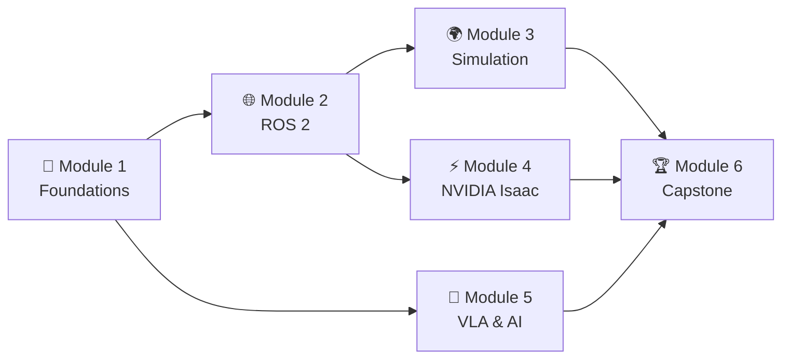

# Course Overview

**Physical AI & Humanoid Robotics** is a practical, project-driven course that takes you from first principles to a deployable, autonomous humanoid robot system. Every module builds on the last, with the capstone project serving as your integration test.

:::note Learning Objectives
By the end of this course you will be able to:

1. Explain the Physical AI stack — from raw sensor data to action execution.
2. Describe the kinematic and dynamic properties of a humanoid robot.
3. Build and run ROS 2 nodes, topics, services, and actions in Python.
4. Navigate a simulated environment using the Nav2 stack.
5. Simulate a robot in Gazebo Harmonic with a custom URDF model.
6. Generate synthetic training data with NVIDIA Isaac Sim and domain randomisation.
7. Deploy Visual SLAM on a real or simulated robot using Isaac ROS.
8. Understand the architecture and training regime of VLA models (π0, RT-2, OpenVLA).
9. Transcribe voice commands in real-time using OpenAI Whisper and route them to ROS 2.
10. Use an LLM with tool-calling to decompose natural-language goals into robot action primitives.
11. Design and deliver a complete autonomous humanoid demo for the capstone.
:::

---

## Module Dependency Map

*Modules 3, 4, and 5 can be studied in parallel once Module 2 is complete.*

---

## Tools & Environment

| Tool | Version | Purpose |
|------|---------|---------|
| ROS 2 Humble | LTS | Robot middleware & communication |
| Gazebo Harmonic | 8.x | Open-source 3D simulation |
| NVIDIA Isaac Sim | 4.x | GPU-accelerated sim & synthetic data |
| Isaac ROS | 3.x | Hardware-accelerated perception |
| Unity | 2022 LTS | Visualisation & HMI |
| Python | 3.10+ | Scripting, AI models, ROS 2 nodes |
| PyTorch / HuggingFace | latest | VLA and LLM inference |
| OpenAI Whisper | large-v3 | Speech recognition |

---

## Full Table of Contents

### 📖 Start Here
- [Start Here](./start-here) — How to use this textbook, style guide
- [Course Overview](./course-overview) — This page

### 🤖 Module 1 — Foundations

| Chapter | Title | Key Topics |
|---------|-------|-----------|
| 1.1 | [Physical AI Foundations](./physical-ai-foundations) | Embodied intelligence, kinematics, control |
| 1.2 | [Sensors & Perception](./sensors-perception) | LiDAR, RGB-D, IMU, sensor fusion |

### 🌐 Module 2 — ROS 2

| Chapter | Title | Key Topics |
|---------|-------|-----------|
| 2.1 | [Introduction to ROS 2](./ros2-intro) | DDS, workspace, build system |
| 2.2 | [Nodes, Topics & Services](./ros2-nodes-topics-services) | Pub/sub, req/res, parameters |
| 2.3 | [Actions & Nav2](./ros2-actions-nav2) | Action servers, Nav2, behaviour trees |

### 🌍 Module 3 — Simulation

| Chapter | Title | Key Topics |
|---------|-------|-----------|
| 3.1 | [Gazebo & Digital Twins](./gazebo-digital-twin) | URDF/SDF, plugins, digital twin |
| 3.2 | [Unity for Robotics Visualisation](./unity-visualization) | Robotics Hub, ROS-TCP, HMI |

### ⚡ Module 4 — NVIDIA Isaac

| Chapter | Title | Key Topics |
|---------|-------|-----------|
| 4.1 | [Isaac Sim & Synthetic Data](./isaac-sim-synthetic-data) | SDG, domain randomisation, Replicator |
| 4.2 | [Isaac ROS & Visual SLAM](./isaac-ros-vslam) | vSLAM, stereo depth, Isaac Perceptor |

### 🧠 Module 5 — VLA & AI

| Chapter | Title | Key Topics |
|---------|-------|-----------|
| 5.1 | [Vision-Language-Action Models](./vla-overview) | π0, RT-2, OpenVLA, architecture |
| 5.2 | [Voice-to-Action with Whisper](./voice-to-action-whisper) | ASR, real-time transcription, ROS 2 |
| 5.3 | [LLM Task Planning → ROS 2](./llm-planning-to-ros) | Tool calling, LangChain, task decomposition |

### 🏆 Module 6 — Capstone

| Chapter | Title | Key Topics |
|---------|-------|-----------|
| 6.1 | [Autonomous Humanoid Robot](./capstone-autonomous-humanoid) | Full system, milestones, rubric |

### 📚 Reference

- [Glossary](./glossary) — Definitions for all key terms
- [References & Further Reading](./references) — Papers, books, courses, tools

---

## Assessment Overview

| Component | Weight | Format |
|-----------|--------|--------|
| Knowledge Checks | 20% | End-of-chapter multiple-choice |
| Lab Exercises | 30% | Hands-on coding tasks (graded by output) |
| Module Mini-Projects | 30% | One deliverable per module |
| Capstone Demo | 20% | Live or recorded autonomous system demo |

:::tip Pacing Guide
- **Self-paced learner:** 2–3 chapters per week → finish in ~8 weeks
- **Intensive bootcamp:** 1–2 modules per day → finish in ~1 week
- **Hackathon sprint:** Follow the critical path in [Start Here](./start-here)
:::
