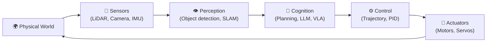
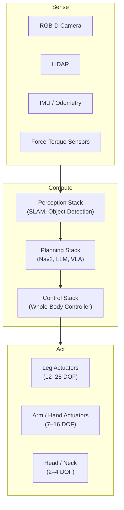

# Chapter 1.1 — Physical AI Foundations

:::note Learning Objectives
After this chapter you will be able to:
- Define Physical AI and contrast it with software-only AI.
- Identify the main subsystems of a humanoid robot.
- Explain forward and inverse kinematics at a conceptual level.
- Describe a basic PID control loop and where it fits in the robotics stack.
:::

---

## 1. What Is Physical AI?

**Physical AI** refers to AI systems that do not just process data — they **act in the physical world**. A language model generates tokens; a Physical AI system generates motor commands that move a real body through a real environment.

The defining characteristic is the **perception–action loop**: the robot continuously senses its environment, reasons about it, and takes actions that change that environment.



*The closed-loop perception–action cycle that defines every Physical AI system.*

:::note The Embodied Hypothesis
Researchers in embodied cognition argue that intelligence cannot be fully separated from a physical body. A robot that manipulates objects learns richer representations of "cup" than a model trained purely on images — because it experiences weight, friction, and breakage.
:::

---

## 2. From Digital AI to Physical AI

| Dimension | Digital AI | Physical AI |
|-----------|-----------|-------------|
| Output | Text, images, predictions | Motor torques, joint angles |
| Latency requirement | 100 ms–10 s acceptable | 1–10 ms for real-time control |
| Error consequence | Wrong answer, retry | Collision, damage, safety risk |
| World model | Statistical / symbolic | Must include physics |
| Feedback | User correction | Continuous sensor feedback |

Physical AI introduces **three hard constraints** that software AI ignores:

1. **Real-time guarantees** — perception and control loops must close within milliseconds.
2. **Physical safety** — failed actions have irreversible consequences.
3. **Embodiment** — the robot's morphology (body shape, DOF, mass) shapes what behaviours are possible.

---

## 3. Humanoid Robot Architecture

A humanoid robot is a mobile manipulator designed to operate in human-scale environments. Its major subsystems:



*Three-layer architecture: sense, compute, act. ROS 2 is the communication backbone at the compute layer.*

### Key Specifications (Representative Humanoid)

| Subsystem | Typical Values |
|-----------|---------------|
| Height | 1.5 – 1.8 m |
| Weight | 50 – 80 kg |
| Total DOF | 30 – 50 |
| Onboard compute | NVIDIA Jetson AGX Orin or equivalent |
| Battery runtime | 1 – 2 hours |
| Locomotion speed | 1 – 3 m/s |

---

## 4. Kinematics Fundamentals

**Kinematics** is the study of motion without reference to forces.

### Forward Kinematics (FK)

Given a set of joint angles **q**, compute the end-effector pose **T**:

> T = f(q) = T₀₁(q₁) · T₁₂(q₂) · ... · Tₙ₋₁ₙ(qₙ)

Each Tᵢ is a 4×4 homogeneous transformation matrix encoding rotation and translation.

:::tip Tools
For humanoids, use **URDF + KDL** (in ROS 2) or **Pinocchio** (C++/Python) to compute FK/IK automatically from your robot model. You rarely need to implement these from scratch.
:::

### Inverse Kinematics (IK)

Given a desired end-effector pose **T**, find the joint angles **q** that achieve it:

> q = f⁻¹(T)

IK is generally underdetermined (infinite solutions) or unsolvable (out of workspace). Numerical solvers like **TRAC-IK** and **BioIK** are standard in the ROS ecosystem.

---

## 5. Control System Basics

The **PID controller** is the workhorse of joint-level control:

```
e(t) = desired_position - actual_position
u(t) = Kp·e(t) + Ki·∫e dt + Kd·(de/dt)
```

| Term | Role | Effect of too-high gain |
|------|------|------------------------|
| Kp (Proportional) | Reduces steady-state error | Oscillation |
| Ki (Integral) | Eliminates steady-state offset | Windup, instability |
| Kd (Derivative) | Dampens oscillation | Noise amplification |

For whole-body humanoid control, more advanced methods are needed:

- **Whole-Body Control (WBC)** — optimises torques across all DOF simultaneously
- **Model Predictive Control (MPC)** — plans a short horizon into the future
- **Reinforcement Learning** — learns control policies from simulation

:::warning Safety Note
Always implement **joint limits** and **torque limits** in software, separate from hardware limits. A runaway PID controller on a 60 kg humanoid can cause serious harm.
:::

---

## Chapter Summary

:::tip Summary
- **Physical AI** closes the perception–action loop in the real world — unlike software AI, it must satisfy real-time, safety, and embodiment constraints.
- A humanoid robot has three layered subsystems: **sense, compute, act**.
- **Forward kinematics** maps joint angles → end-effector pose; **inverse kinematics** inverts this mapping.
- **PID control** is the fundamental tool for joint-level position and velocity control.
:::

---

## Knowledge Check

1. What distinguishes Physical AI from a conventional language model?
2. Name three hard constraints unique to physical robotic systems.
3. In a humanoid robot, which subsystem handles trajectory planning?
4. What is the difference between forward and inverse kinematics?
5. Which PID term is responsible for eliminating steady-state error?

---

## Exercises

**Exercise 1.1 — Perception–Action Diagram** *(Beginner)*
Draw the perception–action loop for a specific task (e.g., "pick up a cup"). Label every arrow with the data type being transmitted (e.g., `sensor_msgs/PointCloud2`).

**Exercise 1.2 — FK Calculator** *(Intermediate)*
Using Python and the `roboticstoolbox` library, load a 6-DOF arm URDF and compute the end-effector pose for three different joint configurations. Verify using a visualiser.

**Exercise 1.3 — PID Tuning** *(Intermediate)*
In Gazebo, spawn a one-DOF pendulum joint and attach a PID controller via `ros2_control`. Tune Kp, Ki, Kd to achieve stable set-point tracking. Record overshoot and settling time for each tuning.
