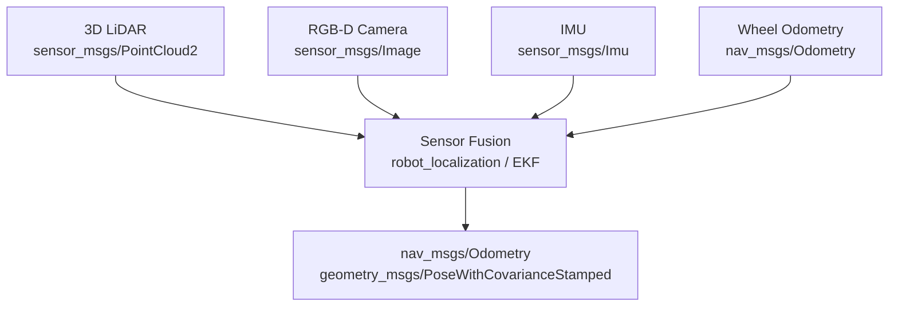
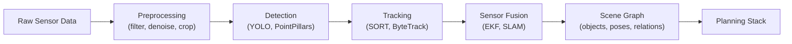

# Chapter 1.2 — Sensors & Perception

:::note Learning Objectives
After this chapter you will be able to:
- List the primary sensor modalities used on humanoid robots and their trade-offs.
- Explain how a LiDAR generates a point cloud and its ROS 2 message type.
- Describe RGB-D depth estimation and its limitations.
- Explain sensor fusion conceptually using a Kalman filter model.
- Sketch the end-to-end perception pipeline from raw data to semantic output.
:::

---

## 1. Sensor Modalities Overview

No single sensor provides everything a robot needs. Robust perception requires **sensor fusion** — combining multiple complementary sources.

| Sensor | Measures | Range | Weakness |
|--------|----------|-------|----------|
| 2D LiDAR | Planar distances | 0.1 – 30 m | No height info |
| 3D LiDAR | Full point cloud | 0.1 – 100 m | Cost, sparse at distance |
| RGB Camera | Colour image | 0.3 m – ∞ | No depth, lighting sensitive |
| RGB-D Camera | Colour + depth | 0.3 – 8 m | Limited range, sunlight issues |
| IMU | Angular rate, linear accel. | — | Drift over time |
| Force-Torque | Contact forces | — | Only at contact point |
| Microphone | Sound / voice | — | Noise, direction uncertainty |

---

## 2. LiDAR

**Light Detection And Ranging (LiDAR)** emits laser pulses and measures the time-of-flight to calculate distance. A rotating LiDAR (e.g., Velodyne VLP-16) sweeps 360° to generate a **point cloud**.

### ROS 2 Message Types

| Data | Message Type |
|------|-------------|
| Single 2D scan | `sensor_msgs/LaserScan` |
| 3D point cloud | `sensor_msgs/PointCloud2` |

### Point Cloud Structure

Each point in a `PointCloud2` message carries:
- **x, y, z** — 3D position in metres
- **intensity** — return strength (material reflectivity)
- **ring** — laser beam index (for multi-layer LiDARs)

:::tip Downsampling
Raw 3D LiDAR data is dense (100k+ points/frame). Use a **VoxelGrid filter** to downsample before processing — this dramatically reduces CPU load with minimal accuracy loss.
```python
# Using Open3D
pcd = o3d.io.read_point_cloud("scan.pcd")
pcd_down = pcd.voxel_down_sample(voxel_size=0.05)  # 5 cm grid
```
:::

---

## 3. RGB-D Cameras

An **RGB-D camera** (e.g., Intel RealSense D435, Microsoft Azure Kinect) provides a colour image paired with a per-pixel depth map.

**Depth estimation methods:**

| Method | Principle | Example Hardware |
|--------|-----------|-----------------|
| Structured light | Projects a known IR pattern | RealSense D415 |
| Time-of-flight | Measures phase shift of IR pulses | Azure Kinect |
| Stereo vision | Triangulation from two cameras | ZED 2, RealSense D435 |

### Limitations

:::warning RGB-D Limitations
- **Outdoor sunlight** washes out structured-light sensors — use stereo or LiDAR outdoors.
- **Shiny or transparent surfaces** (glass, polished metal) produce invalid depth readings.
- **Maximum range** is typically 4–8 m, insufficient for navigation in large spaces.
:::

### ROS 2 Topics (RealSense example)

```bash
/camera/color/image_raw          # sensor_msgs/Image
/camera/depth/image_rect_raw     # sensor_msgs/Image (16-bit mm)
/camera/depth/color/points       # sensor_msgs/PointCloud2
```

---

## 4. IMU — Inertial Measurement Unit

An IMU combines a **3-axis accelerometer** and a **3-axis gyroscope** (and often a magnetometer) to measure:
- Linear acceleration (m/s²)
- Angular velocity (rad/s)

### The Drift Problem

Integrating acceleration to get velocity, or integrating angular rate to get orientation, **accumulates error over time**. After 60 seconds, a MEMS IMU can have several degrees of orientation error.

Solutions:
- **Visual-Inertial Odometry (VIO)** — fuses camera and IMU to cancel drift
- **Wheel odometry fusion** — for wheeled robots
- **GNSS fusion** — for outdoor applications

ROS 2 message type: `sensor_msgs/Imu`

---

## 5. Sensor Fusion

**Sensor fusion** combines multiple data streams to produce an estimate more accurate than any individual sensor.



*All sensor streams converge into a single fused pose estimate used by the navigation stack.*

### Extended Kalman Filter (EKF)

The **EKF** is the standard tool for fusing IMU + odometry + GPS:

1. **Predict** — propagate state estimate forward using the motion model (IMU integration)
2. **Update** — correct the prediction using a slower but accurate measurement (odometry, SLAM pose)

In ROS 2, the `robot_localization` package provides a drop-in EKF node:

```yaml
# ekf.yaml (excerpt)
frequency: 30.0
odom0: /wheel/odometry
odom0_config: [false, false, false,  # x y z
               false, false, false,  # roll pitch yaw
               true,  true,  false,  # vx vy vz
               false, false, true,   # vroll vpitch vyaw
               false, false, false]
imu0: /imu/data
imu0_config: [false, false, false,
              true, true, true,
              false, false, false,
              true, true, true,
              true, false, false]
```

---

## 6. The Perception Pipeline

A complete perception pipeline transforms raw sensor data into semantic scene understanding:



*Raw data enters on the left; the planning stack receives a rich semantic scene on the right.*

### Key ROS 2 Packages

| Stage | Package |
|-------|---------|
| Point cloud processing | `pcl_ros`, `open3d_ros_helper` |
| 2D object detection | `vision_msgs` + your model node |
| Localisation / SLAM | `slam_toolbox`, `isaac_ros_visual_slam` |
| Sensor fusion | `robot_localization` |

---

## Chapter Summary

:::tip Summary
- No single sensor is sufficient — **sensor fusion** is mandatory for robust robot perception.
- **LiDAR** provides accurate spatial data; **RGB-D** adds colour and medium-range depth; **IMU** provides high-rate motion data but drifts.
- The **EKF** (via `robot_localization`) is the standard ROS 2 approach to fusing odometry and IMU.
- The perception pipeline stages are: **preprocess → detect → track → fuse → scene graph**.
:::

---

## Knowledge Check

1. Which sensor type is most affected by outdoor sunlight?
2. What causes IMU drift and how is it mitigated?
3. What ROS 2 message type carries a 3D point cloud?
4. Name the two steps of an Extended Kalman Filter cycle.
5. What stage of the perception pipeline converts detections into a semantic scene graph?

---

## Exercises

**Exercise 1.4 — Sensor Comparison Table** *(Beginner)*
Research three commercially available humanoid robots (e.g., Unitree H1, Boston Dynamics Atlas, Agility Digit). Create a table comparing their sensor suites, then list one perception capability each sensor enables.

**Exercise 1.5 — Point Cloud Subscriber** *(Intermediate)*
Write a ROS 2 Python node that subscribes to `/camera/depth/color/points` from a RealSense (or rosbag replay) and prints the number of valid points per frame. Then add a VoxelGrid filter using Open3D to downsample the cloud to a 5 cm grid.

**Exercise 1.6 — EKF Configuration** *(Intermediate)*
In a Gazebo simulation, launch `robot_localization` with your robot's IMU and odometry topics. Record the raw odometry vs. the EKF-fused estimate during a 30-second square path. Plot the difference in estimated vs. actual end position.
