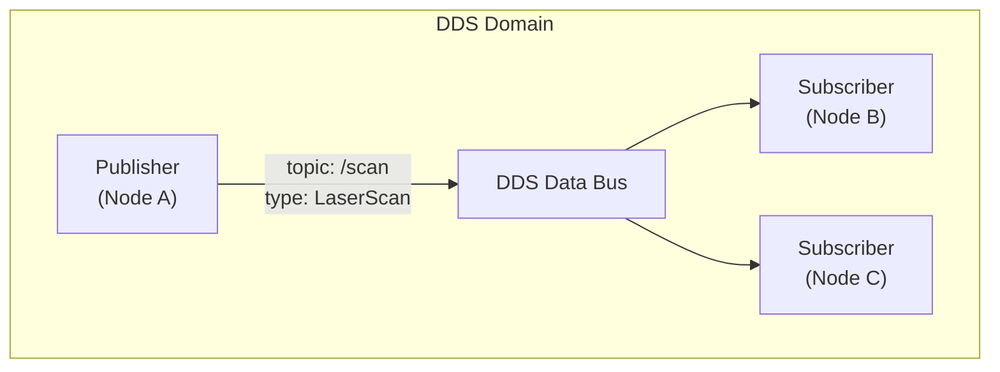
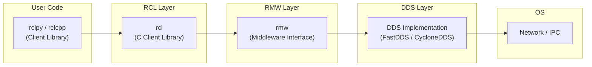
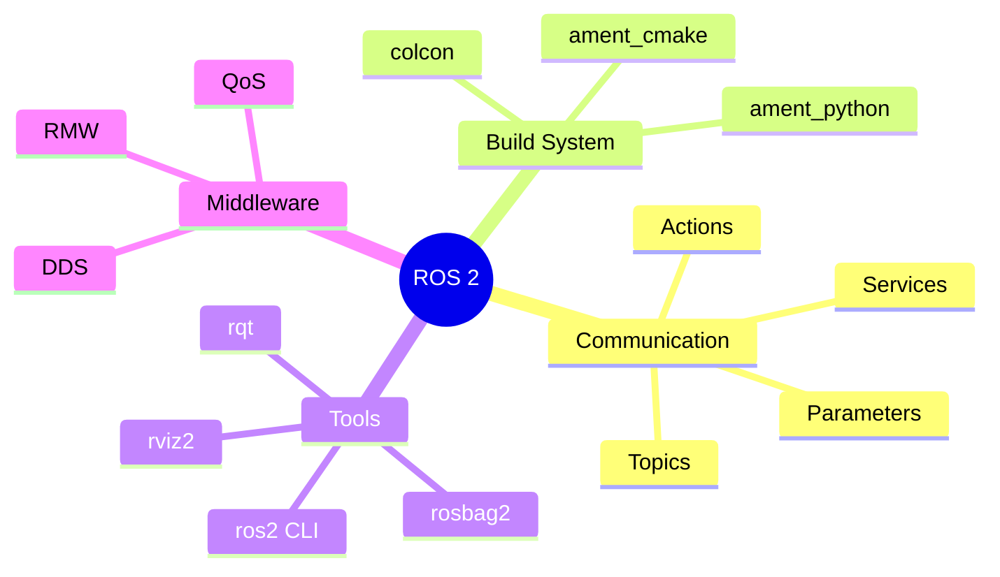

# Chapter 2.1 — Introduction to ROS 2

:::note Learning Objectives
After this chapter you will be able to:
- Explain why ROS 2 was created and how it improves on ROS 1.
- Describe the role of DDS as the ROS 2 communication layer.
- Set up a ROS 2 workspace and build packages with colcon.
- Use the `ros2` CLI to inspect running nodes and topics.
:::

---

## 1. What Is ROS 2?

**Robot Operating System 2 (ROS 2)** is an open-source middleware framework for building robot software. Despite the name, it is not an operating system — it is a collection of **tools, libraries, and conventions** that help roboticists develop modular, reusable software.

Key capabilities:
- **Publish/subscribe messaging** between distributed processes
- **Service and action** interfaces for request/response and long-running tasks
- **Hardware abstraction** through standardised message types
- **Simulation integration** with Gazebo and Isaac Sim
- **Language support** for Python (`rclpy`) and C++ (`rclcpp`)

---

## 2. ROS 1 vs ROS 2

| Feature | ROS 1 | ROS 2 |
|---------|-------|-------|
| Communication | Custom TCPROS | DDS (Data Distribution Service) |
| Master / broker | Required (`roscore`) | None — fully peer-to-peer |
| Real-time support | No | Yes (with RCLC + RT kernel) |
| Multi-robot support | Difficult | Native via DDS namespacing |
| Windows support | No | Yes |
| Python version | Python 2/3 | Python 3 only |
| Build system | catkin | colcon + ament |
| LTS releases | No | Yes (2-year cycle) |

:::note Why the Rewrite?
ROS 1 required a central `roscore` process — a single point of failure. ROS 2 replaced this with **DDS**, which is a proven industrial standard used in avionics, defence, and medical devices. This enables true real-time, fault-tolerant distributed systems.
:::

---

## 3. DDS Middleware

**Data Distribution Service (DDS)** is the communication backbone of ROS 2. Key concepts:



*Multiple subscribers can receive the same topic without any broker or master process.*

### QoS Policies

DDS exposes **Quality of Service (QoS)** settings that control how messages are delivered:

| Policy | Options | Use Case |
|--------|---------|----------|
| Reliability | RELIABLE / BEST_EFFORT | Control vs. sensor data |
| Durability | VOLATILE / TRANSIENT_LOCAL | Config vs. live data |
| History | KEEP_LAST(N) / KEEP_ALL | Sensor buffering |
| Deadline | Duration | Safety-critical timing |

```python
from rclpy.qos import QoSProfile, ReliabilityPolicy, DurabilityPolicy

qos = QoSProfile(
    reliability=ReliabilityPolicy.BEST_EFFORT,
    durability=DurabilityPolicy.VOLATILE,
    depth=10
)
```

### DDS Implementations

| Implementation | Package | Notes |
|----------------|---------|-------|
| FastDDS | `rmw_fastrtps_cpp` | Default in Humble |
| Cyclone DDS | `rmw_cyclonedds_cpp` | Often better for real-time |
| Connext DDS | Commercial | For safety-certified systems |

---

## 4. ROS 2 Architecture



*ROS 2 is layered: your Python/C++ code sits on top of a portable abstraction that routes through DDS to the network.*

---

## 5. Workspace Setup

A ROS 2 **workspace** is a directory that contains your packages. The standard layout:

```
~/ros2_ws/
├── src/           ← your package source code
├── build/         ← intermediate build files (auto-generated)
├── install/       ← installed packages (auto-generated)
└── log/           ← build logs (auto-generated)
```

### Create and Build a Workspace

```bash
# 1. Source the ROS 2 base installation
source /opt/ros/humble/setup.bash

# 2. Create the workspace
mkdir -p ~/ros2_ws/src
cd ~/ros2_ws

# 3. Clone a package (example)
cd src
ros2 pkg create --build-type ament_python my_robot_pkg

# 4. Build everything
cd ~/ros2_ws
colcon build --symlink-install

# 5. Source the workspace overlay
source install/setup.bash
```

:::tip `--symlink-install`
This flag links Python files instead of copying them. Edits to `.py` files take effect immediately without rebuilding — essential for fast iteration.
:::

### Useful CLI Commands

```bash
ros2 node list                     # list running nodes
ros2 topic list                    # list active topics
ros2 topic echo /scan              # print messages on a topic
ros2 topic info /scan --verbose    # show publishers, subscribers, QoS
ros2 interface show sensor_msgs/msg/LaserScan  # inspect message fields
ros2 doctor                        # diagnose common setup issues
```

---

## 6. Key Concepts Summary



---

## Chapter Summary

:::tip Summary
- ROS 2 replaces the brittle ROS 1 master with **DDS** — a peer-to-peer, real-time-capable middleware.
- The **colcon** build tool and **ament** build types replace the ROS 1 catkin system.
- **QoS policies** give fine-grained control over message delivery guarantees.
- The `ros2` CLI is your primary tool for inspecting and debugging running systems.
:::

---

## Knowledge Check

1. What problem with ROS 1 motivated the creation of ROS 2?
2. What is DDS and which layer of ROS 2 uses it?
3. Name two QoS policies and their effect on message delivery.
4. What does `--symlink-install` do during a colcon build?
5. Which CLI command shows the publishers and subscribers of a topic?

---

## Exercises

**Exercise 2.1 — Workspace Creation** *(Beginner)*
Create a new ROS 2 workspace, add an `ament_python` package named `physai_hello`, and add a Python executable that prints `"Hello, Physical AI!"` on startup. Build and run it.

**Exercise 2.2 — CLI Exploration** *(Beginner)*
Launch the demo talker and listener: `ros2 run demo_nodes_py talker` and `ros2 run demo_nodes_py listener`. Use `ros2 topic info` and `ros2 topic hz` to measure the publish rate, message type, and number of subscribers.

**Exercise 2.3 — QoS Mismatch** *(Intermediate)*
Write two minimal nodes: one publisher with `BEST_EFFORT` reliability and one subscriber with `RELIABLE` reliability. Observe what happens on the same topic. Then fix the mismatch and confirm messages arrive. Explain why the mismatch caused the failure.
