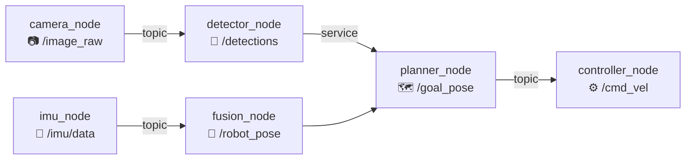
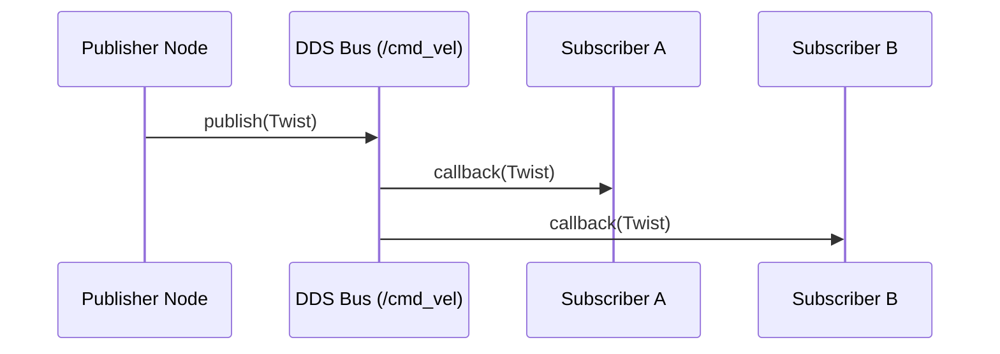
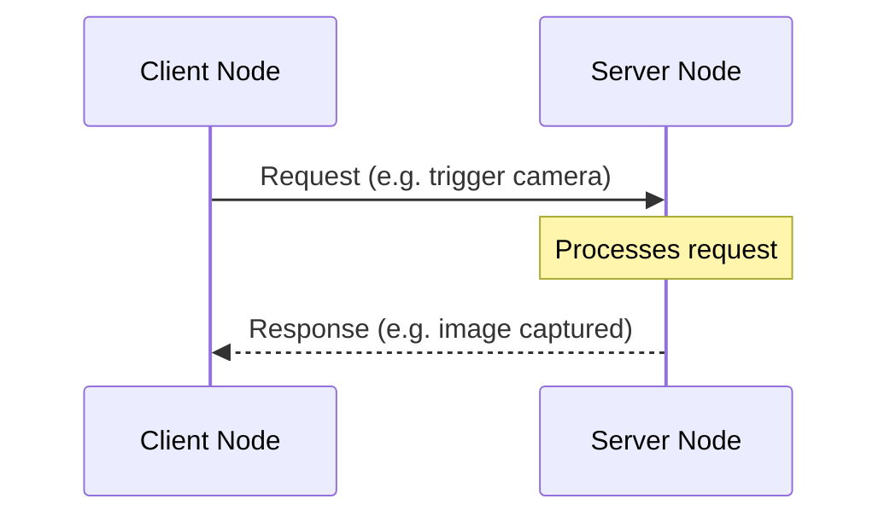

# Chapter 2.2 — Nodes, Topics & Services

:::note Learning Objectives
After this chapter you will be able to:
- Write a ROS 2 publisher and subscriber node in Python.
- Create and call a ROS 2 service from the CLI and from Python.
- Declare and use ROS 2 parameters in a node.
- Explain QoS policy choices for different sensor and control scenarios.
:::

---

## 1. Nodes

A **node** is a single executable process in a ROS 2 system. Each node has a single responsibility (e.g., read a camera, run object detection, publish a velocity command). Nodes communicate with each other using topics, services, and actions.



*A realistic pipeline showing nodes communicating via topics and services.*

### Minimal Node (Python)

```python
import rclpy
from rclpy.node import Node

class MinimalNode(Node):
    def __init__(self):
        super().__init__('minimal_node')
        self.get_logger().info('Node started!')

def main(args=None):
    rclpy.init(args=args)
    node = MinimalNode()
    rclpy.spin(node)          # keep alive until Ctrl+C
    node.destroy_node()
    rclpy.shutdown()

if __name__ == '__main__':
    main()
```

---

## 2. Topics — Publish / Subscribe

A **topic** is a named, typed, unidirectional data channel. Publishers write to it; any number of subscribers read from it. There is **no synchronisation** — publishers do not wait for subscribers.



*One publisher, multiple subscribers — all decoupled from each other.*

### Publisher Node

```python
from rclpy.node import Node
from geometry_msgs.msg import Twist

class VelocityPublisher(Node):
    def __init__(self):
        super().__init__('velocity_publisher')
        self.pub = self.create_publisher(Twist, '/cmd_vel', 10)
        self.timer = self.create_timer(0.1, self.publish_velocity)  # 10 Hz

    def publish_velocity(self):
        msg = Twist()
        msg.linear.x = 0.5   # m/s forward
        msg.angular.z = 0.0  # rad/s rotation
        self.pub.publish(msg)
        self.get_logger().info(f'Publishing: vx={msg.linear.x}')
```

### Subscriber Node

```python
from rclpy.node import Node
from geometry_msgs.msg import Twist

class VelocitySubscriber(Node):
    def __init__(self):
        super().__init__('velocity_subscriber')
        self.sub = self.create_subscription(
            Twist, '/cmd_vel', self.on_velocity, 10)

    def on_velocity(self, msg: Twist):
        self.get_logger().info(
            f'Received: vx={msg.linear.x:.2f}, wz={msg.angular.z:.2f}')
```

:::tip Common Message Packages
| Package | Message Types |
|---------|--------------|
| `std_msgs` | `String`, `Int32`, `Float64`, `Bool` |
| `geometry_msgs` | `Twist`, `Pose`, `Point`, `Transform` |
| `sensor_msgs` | `Image`, `LaserScan`, `PointCloud2`, `Imu` |
| `nav_msgs` | `Odometry`, `Path`, `OccupancyGrid` |
:::

---

## 3. Services — Request / Response

A **service** is a synchronous, bidirectional communication channel. One node (the **server**) exposes a named endpoint; another (the **client**) calls it and waits for a response.

Use services for:
- Configuration changes (`/set_parameters`)
- One-shot queries (`/get_map_data`)
- Short-duration operations (< 1 second)



### Service Definition

```
# my_interfaces/srv/TakePhoto.srv
string filename   # REQUEST
---
bool success      # RESPONSE
string message
```

### Service Server (Python)

```python
from rclpy.node import Node
from my_interfaces.srv import TakePhoto

class CameraServer(Node):
    def __init__(self):
        super().__init__('camera_server')
        self.srv = self.create_service(
            TakePhoto, '/take_photo', self.handle_take_photo)

    def handle_take_photo(self, request, response):
        self.get_logger().info(f'Taking photo: {request.filename}')
        # ... save image logic ...
        response.success = True
        response.message = f'Saved to {request.filename}'
        return response
```

### Service Client (Python)

```python
from rclpy.node import Node
from my_interfaces.srv import TakePhoto

class CameraClient(Node):
    def __init__(self):
        super().__init__('camera_client')
        self.cli = self.create_client(TakePhoto, '/take_photo')
        self.cli.wait_for_service(timeout_sec=5.0)

    def send_request(self, filename: str):
        req = TakePhoto.Request()
        req.filename = filename
        future = self.cli.call_async(req)
        return future
```

:::warning Blocking vs Async
Never use `cli.call()` (synchronous/blocking) inside a callback — it will deadlock. Always use `call_async()` and handle the result with `rclpy.spin_until_future_complete()` or a callback.
:::

---

## 4. Parameters

**Parameters** are node configuration values that can be read/written at runtime without restarting the node.

```python
class ConfigurableNode(Node):
    def __init__(self):
        super().__init__('configurable_node')
        # Declare with default value
        self.declare_parameter('speed', 0.5)
        self.declare_parameter('max_angle', 1.57)

    def run(self):
        speed = self.get_parameter('speed').get_parameter_value().double_value
        self.get_logger().info(f'Speed = {speed}')
```

Set parameters via CLI:

```bash
ros2 param set /configurable_node speed 1.2
ros2 param get /configurable_node speed
ros2 param dump /configurable_node   # export to YAML
```

Or via a YAML launch parameter file:

```yaml
configurable_node:
  ros__parameters:
    speed: 1.2
    max_angle: 0.78
```

---

## Chapter Summary

:::tip Summary
- **Nodes** are isolated processes; each has one clear responsibility.
- **Topics** implement publish/subscribe for continuous data streams (sensors, commands).
- **Services** implement request/response for one-shot or configuration operations.
- **Parameters** allow runtime configuration without node restarts.
- Use `BEST_EFFORT` QoS for high-rate sensors; `RELIABLE` for critical commands.
:::

---

## Knowledge Check

1. What is the difference between a topic and a service in terms of communication pattern?
2. Why should you never call a service synchronously inside a subscriber callback?
3. What ROS 2 message type would you use to send a velocity command to a robot base?
4. How do you set a parameter on a running node without restarting it?
5. In the publisher node example, what determines the publishing rate?

---

## Exercises

**Exercise 2.4 — Sensor → Controller Pipeline** *(Beginner)*
Write two nodes: a publisher that simulates an IMU by publishing random `sensor_msgs/Imu` messages at 100 Hz, and a subscriber that logs the linear acceleration magnitude on every message.

**Exercise 2.5 — Service for Emergency Stop** *(Intermediate)*
Define a custom service type `EmergencyStop.srv` with no request fields and a `bool stopped` response. Implement a server node that sets a flag and publishes zero velocity to `/cmd_vel` when the service is called. Test it from the CLI with `ros2 service call`.

**Exercise 2.6 — Dynamic Parameter Tuning** *(Intermediate)*
Create a node that publishes a sine wave on `/signal` at a frequency defined by a `frequency` parameter (default: 1.0 Hz). Use `ros2 param set` to change the frequency while the node is running and verify the output changes in `ros2 topic echo`.
