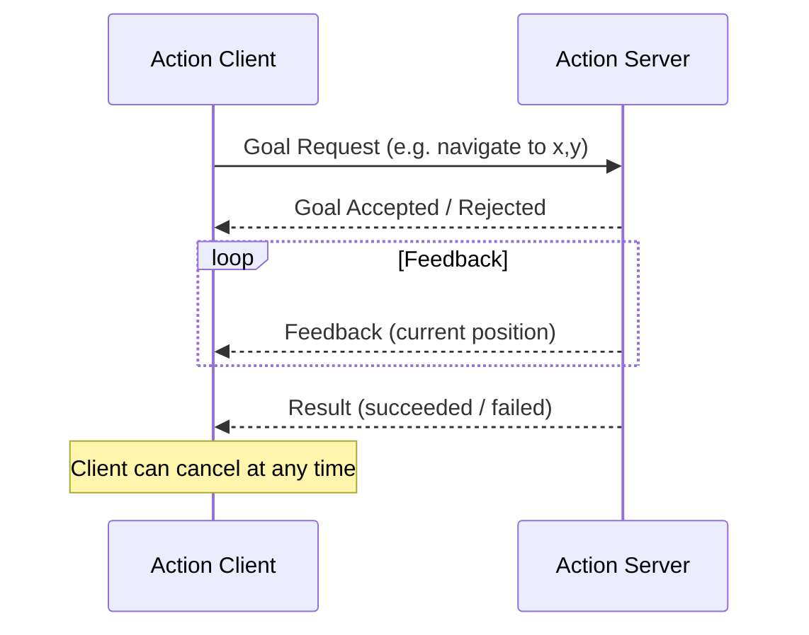
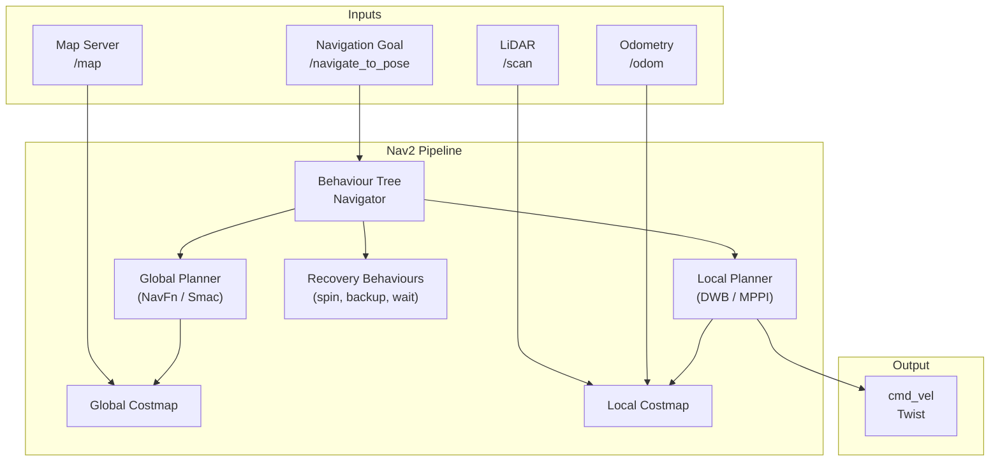

# Chapter 2.3 — Actions & Nav2

:::note Learning Objectives
After this chapter you will be able to:
- Explain when to use an action versus a service.
- Implement a simple action server and client in Python.
- Describe the Nav2 stack and its major components.
- Explain the role of costmaps, global and local planners, and behaviour trees.
- Send a navigation goal to Nav2 from Python code.
:::

---

## 1. Actions

**Actions** are the third ROS 2 communication primitive. Like services, they are request/response — but unlike services, they:
- Execute **long-duration** tasks (seconds to minutes)
- Provide **feedback** during execution
- Can be **cancelled** by the client at any time

Use actions for: navigation goals, manipulation tasks, long calibration routines.



### Action Definition

An action has three parts: **Goal**, **Result**, and **Feedback**:

```
# my_interfaces/action/MoveTo.action

# GOAL
geometry_msgs/Pose target_pose
float32 speed_limit
---
# RESULT
bool success
float32 distance_travelled
---
# FEEDBACK
geometry_msgs/Pose current_pose
float32 distance_remaining
```

### Action Server (Python)

```python
import rclpy
from rclpy.action import ActionServer
from rclpy.node import Node
from my_interfaces.action import MoveTo

class MoveToServer(Node):
    def __init__(self):
        super().__init__('move_to_server')
        self._server = ActionServer(
            self, MoveTo, 'move_to',
            execute_callback=self.execute_callback)

    async def execute_callback(self, goal_handle):
        self.get_logger().info('Executing goal...')
        feedback = MoveTo.Feedback()

        for i in range(10):
            # Simulate progress
            feedback.distance_remaining = float(10 - i)
            goal_handle.publish_feedback(feedback)
            await asyncio.sleep(0.5)

            if goal_handle.is_cancel_requested:
                goal_handle.canceled()
                return MoveTo.Result(success=False)

        goal_handle.succeed()
        result = MoveTo.Result()
        result.success = True
        result.distance_travelled = 5.0
        return result
```

### Action Client (Python)

```python
from rclpy.action import ActionClient
from my_interfaces.action import MoveTo

class MoveToClient(Node):
    def __init__(self):
        super().__init__('move_to_client')
        self._client = ActionClient(self, MoveTo, 'move_to')

    def send_goal(self, x, y):
        goal = MoveTo.Goal()
        goal.target_pose.position.x = x
        goal.target_pose.position.y = y
        self._client.wait_for_server()
        future = self._client.send_goal_async(
            goal, feedback_callback=self.on_feedback)
        return future

    def on_feedback(self, feedback_msg):
        fb = feedback_msg.feedback
        self.get_logger().info(f'Remaining: {fb.distance_remaining:.1f} m')
```

---

## 2. Nav2 — Navigation Stack

**Nav2** is the standard ROS 2 navigation framework for autonomous mobile robots. It provides a complete pipeline from sensor input to velocity output.



*Nav2's data flow: sensor data populates costmaps; the behaviour tree orchestrates the global planner, local planner, and recovery behaviours.*

---

## 3. Costmaps

A **costmap** is a 2D grid where each cell holds a cost value (0 = free, 254 = lethal obstacle, 255 = unknown). Nav2 maintains two:

| Costmap | Purpose | Update Rate |
|---------|---------|------------|
| Global Costmap | Long-range path planning | Slow (static + lidar) |
| Local Costmap | Real-time obstacle avoidance | Fast (lidar only, small window) |

Costmap **layers** combine multiple data sources:
- **Static Layer** — the known map
- **Obstacle Layer** — real-time LiDAR / depth camera obstacles
- **Inflation Layer** — expands obstacles by robot radius + safety margin

```yaml
# nav2_params.yaml (excerpt)
local_costmap:
  local_costmap:
    ros__parameters:
      width: 3.0
      height: 3.0
      resolution: 0.05
      robot_radius: 0.22
      plugins: ["obstacle_layer", "inflation_layer"]
      inflation_layer:
        cost_scaling_factor: 3.0
        inflation_radius: 0.55
```

---

## 4. Planners

| Component | Type | Algorithm | Use Case |
|-----------|------|-----------|----------|
| Global Planner | NavFn | Dijkstra | Simple, reliable |
| Global Planner | Smac Planner | A* / Hybrid A* | Kinodynamic constraints |
| Local Planner | DWB | Dynamic Window | Standard ground robots |
| Local Planner | MPPI | Model Predictive Path Integral | Smooth, fast trajectories |

:::tip MPPI for Humanoids
For humanoid robots, **MPPI** (Model Predictive Path Integral) produces smoother, more natural trajectories than DWB. Enable it in `nav2_params.yaml`:
```yaml
FollowPath:
  plugin: "nav2_mppi_controller::MPPIController"
  time_steps: 56
  model_dt: 0.05
  batch_size: 2000
```
:::

---

## 5. Behaviour Trees

Nav2 uses **Behaviour Trees (BTs)** to sequence planners, recovery behaviours, and custom logic. BTs are more flexible and transparent than state machines.

```xml
<!-- navigate_to_pose_bt.xml (simplified) -->
<root main_tree_to_execute="MainTree">
  <BehaviorTree ID="MainTree">
    <RecoveryNode number_of_retries="6" name="NavigateRecovery">
      <PipelineSequence name="NavigateWithReplanning">
        <RateController hz="1.0">
          <ComputePathToPose goal="{goal}" path="{path}" />
        </RateController>
        <FollowPath path="{path}" controller_id="FollowPath" />
      </PipelineSequence>
      <ReactiveFallback name="RecoveryFallback">
        <GoalUpdated/>
        <RoundRobin name="RecoveryActions">
          <Sequence name="ClearingActions">
            <ClearEntireCostmap service_name="local_costmap/clear_entirely_local_costmap"/>
          </Sequence>
          <Spin spin_dist="1.57"/>
          <BackUp backup_dist="0.30" backup_speed="0.05"/>
          <Wait wait_duration="5"/>
        </RoundRobin>
      </ReactiveFallback>
    </RecoveryNode>
  </BehaviorTree>
</root>
```

---

## 6. Sending a Navigation Goal from Python

```python
from nav2_msgs.action import NavigateToPose
from geometry_msgs.msg import PoseStamped
from rclpy.action import ActionClient

class Navigator(Node):
    def __init__(self):
        super().__init__('simple_navigator')
        self._nav_client = ActionClient(self, NavigateToPose, 'navigate_to_pose')

    def go_to(self, x: float, y: float, yaw: float = 0.0):
        goal = NavigateToPose.Goal()
        goal.pose = PoseStamped()
        goal.pose.header.frame_id = 'map'
        goal.pose.header.stamp = self.get_clock().now().to_msg()
        goal.pose.pose.position.x = x
        goal.pose.pose.position.y = y
        # Convert yaw to quaternion (simplified: z=sin(yaw/2), w=cos(yaw/2))
        import math
        goal.pose.pose.orientation.z = math.sin(yaw / 2)
        goal.pose.pose.orientation.w = math.cos(yaw / 2)

        self._nav_client.wait_for_server()
        self.get_logger().info(f'Navigating to ({x:.1f}, {y:.1f})')
        return self._nav_client.send_goal_async(goal)
```

---

## Chapter Summary

:::tip Summary
- **Actions** are used for long-running tasks; they support feedback and cancellation.
- **Nav2** provides a full navigation pipeline: costmaps → global planner → local planner → velocity output.
- **Costmaps** combine static map + real-time sensor data into a cost grid.
- **Behaviour Trees** in Nav2 make the navigation logic transparent, composable, and recoverable.
- Send navigation goals via the `NavigateToPose` action interface.
:::

---

## Knowledge Check

1. What are the three communication components of a ROS 2 action?
2. When should you use an action instead of a service?
3. What is the difference between the global costmap and the local costmap?
4. What recovery behaviour does Nav2 perform if the path is blocked?
5. What frame_id should a navigation goal use when working from a map?

---

## Exercises

**Exercise 2.7 — Timer Action Server** *(Beginner)*
Implement a `CountDown` action: the goal specifies an integer N, the server counts down from N to 0 (1 second per step), sends feedback on each count, and returns `success=True` when done. The client should be cancellable mid-way through.

**Exercise 2.8 — Nav2 in Gazebo** *(Intermediate)*
Launch the TurtleBot3 simulation in Gazebo with Nav2. Using `ros2 topic pub` or a Python script, send three consecutive navigation goals to form a triangle path. Log the start time and end time for each segment.

**Exercise 2.9 — Custom BT Node** *(Advanced)*
Write a custom Nav2 Behaviour Tree Condition node called `IsBatteryLow` that checks a `/battery_state` topic. Integrate it into the Nav2 BT XML so the robot returns to a dock pose when battery < 20%.
