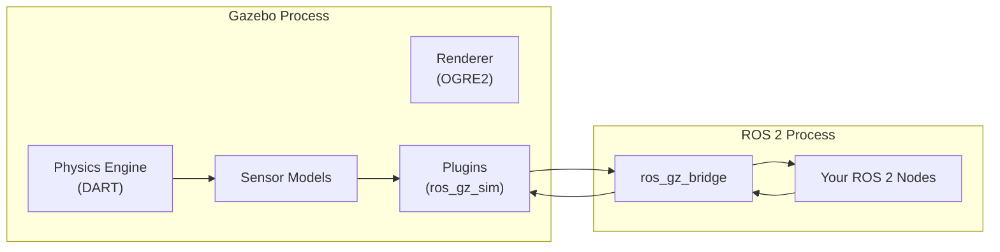
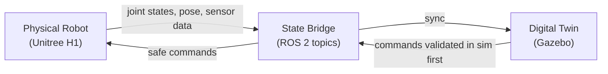

# Chapter 3.1 — Gazebo & Digital Twins

:::note Learning Objectives
After this chapter you will be able to:
- Explain what a digital twin is and how Gazebo implements one.
- Describe the difference between URDF and SDF robot model formats.
- Launch a robot in Gazebo Harmonic and connect it to ROS 2.
- Add sensors and actuators to a robot model using Gazebo plugins.
:::

---

## 1. Why Simulate?

Simulation is the **primary development environment** for robotics. The reasons are practical:

| Challenge | Physical Robot | Simulation |
|-----------|---------------|------------|
| Hardware availability | Limited, expensive | Unlimited, free |
| Damage risk | Real — crashes destroy hardware | None |
| Data collection speed | Real-time only | Faster-than-real-time |
| Environment control | Difficult | Fully controllable |
| Reproducibility | Hard (wear, conditions) | Perfect |

:::warning Sim-to-Real Gap
Simulated physics is an approximation. Friction, contact dynamics, actuator compliance, and sensor noise all differ between simulation and reality. Closing this **sim-to-real gap** is a major research challenge addressed in Module 4 with domain randomisation.
:::

---

## 2. Gazebo Harmonic

**Gazebo Harmonic** (formerly Ignition Gazebo) is the current-generation open-source robot simulator maintained by Open Robotics. Key features:

- **Physics engines:** DART, bullet, TPE
- **Rendering:** OGRE 2.x with PBR materials
- **Sensors:** LiDAR, IMU, RGB camera, depth camera, force/torque
- **Plugin system:** C++ and Python plugins
- **ROS 2 bridge:** `ros_gz_bridge`



*Gazebo and ROS 2 run as separate processes; `ros_gz_bridge` converts between Gazebo Transport and ROS 2 DDS messages.*

---

## 3. Robot Models — URDF vs SDF

### URDF (Unified Robot Description Format)

URDF is an **XML format** describing robot kinematics and dynamics. It is the standard in ROS 2:

```xml
<!-- my_robot.urdf (simplified) -->
<robot name="my_robot">
  <!-- Base link -->
  <link name="base_link">
    <visual>
      <geometry><box size="0.5 0.3 0.1"/></geometry>
      <material name="blue"><color rgba="0 0 1 1"/></material>
    </visual>
    <collision>
      <geometry><box size="0.5 0.3 0.1"/></geometry>
    </collision>
    <inertial>
      <mass value="5.0"/>
      <inertia ixx="0.1" ixy="0" ixz="0" iyy="0.1" iyz="0" izz="0.1"/>
    </inertial>
  </link>

  <!-- Left wheel joint -->
  <joint name="left_wheel_joint" type="continuous">
    <parent link="base_link"/>
    <child link="left_wheel"/>
    <origin xyz="0 0.18 0" rpy="0 0 0"/>
    <axis xyz="0 1 0"/>
  </joint>
</robot>
```

### SDF (Simulation Description Format)

SDF is Gazebo's native format. It supports features URDF lacks: **nested models**, **multiple physics engines**, **world files**, **lights**, and **atmosphere**.

:::tip URDF → SDF Conversion
When launching a URDF in Gazebo, it is auto-converted to SDF internally. For complex robots, maintain a `model.sdf` directly for full control over simulation properties.
:::

---

## 4. Digital Twins

A **digital twin** is a live simulation that mirrors a physical system in real time. In robotics, this means:



*In a digital twin workflow, commands are validated in simulation before being sent to the real robot.*

Digital twin use cases:
1. **Shadow mode** — sim mirrors real robot, detects divergence
2. **Pre-flight checks** — test trajectories in sim before physical execution
3. **Predictive maintenance** — detect abnormal forces/torques that predict failure
4. **Operator training** — staff practice on the twin before touching the real robot

---

## 5. Launching a Robot in Gazebo with ROS 2

```python
# my_robot_launch.py
from launch import LaunchDescription
from launch.actions import ExecuteProcess, IncludeLaunchDescription
from launch_ros.actions import Node

def generate_launch_description():
    return LaunchDescription([
        # Start Gazebo with an empty world
        ExecuteProcess(
            cmd=['gz', 'sim', '-r', 'empty.sdf'],
            output='screen'
        ),
        # Spawn the robot URDF
        Node(
            package='ros_gz_sim',
            executable='create',
            arguments=['-name', 'my_robot', '-file', 'my_robot.urdf'],
            output='screen'
        ),
        # Bridge joint states from Gazebo → ROS 2
        Node(
            package='ros_gz_bridge',
            executable='parameter_bridge',
            arguments=['/joint_states@sensor_msgs/msg/JointState[gz.msgs.Model'],
            output='screen'
        ),
    ])
```

### Key Plugins for Humanoid Robots

| Plugin | Purpose |
|--------|---------|
| `gz-sim-joint-state-publisher` | Publishes joint states to ROS 2 |
| `gz-sim-diff-drive` | Differential drive base controller |
| `gz-sim-imu-system` | IMU sensor simulation |
| `gz-sim-sensors-system` | Camera and LiDAR simulation |
| `gz-sim-contact-system` | Contact and force-torque sensors |

---

## Chapter Summary

:::tip Summary
- Simulation eliminates hardware risk and enables faster iteration; the key challenge is the **sim-to-real gap**.
- **Gazebo Harmonic** is the current-gen open-source simulator; it connects to ROS 2 via `ros_gz_bridge`.
- **URDF** is the ROS 2 standard model format; **SDF** is Gazebo's native format with more simulation-specific features.
- A **digital twin** is a live simulation that mirrors the physical robot — enabling pre-flight validation and anomaly detection.
:::

---

## Knowledge Check

1. Name three advantages of developing in simulation over using physical hardware.
2. What is the sim-to-real gap and why does it matter?
3. What does `ros_gz_bridge` do?
4. What is the difference between a `<visual>` tag and a `<collision>` tag in a URDF?
5. Describe one use case for a digital twin in a production robotics deployment.

---

## Exercises

**Exercise 3.1 — Custom URDF Robot** *(Beginner)*
Create a URDF for a simple two-wheeled robot with a rectangular base. Add a `<collision>` mesh and `<inertial>` properties. Launch it in Gazebo and use `ros2 topic echo /joint_states` to verify joint state publishing.

**Exercise 3.2 — Sensor Integration** *(Intermediate)*
Add a simulated LiDAR (Hokuyo-style) to your URDF using the Gazebo sensor plugin. Bridge the `/scan` topic to ROS 2 and visualise it in RViz2. Drive the robot in Gazebo and observe the scan updating.

**Exercise 3.3 — Digital Twin Shadow** *(Advanced)*
Write a ROS 2 node that subscribes to both `/joint_states` from the physical robot (or a rosbag) and from the Gazebo simulation. Compute and publish the per-joint angle difference. Alert when any joint diverges by more than 5°.
