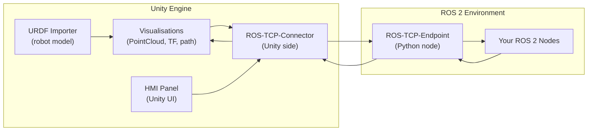
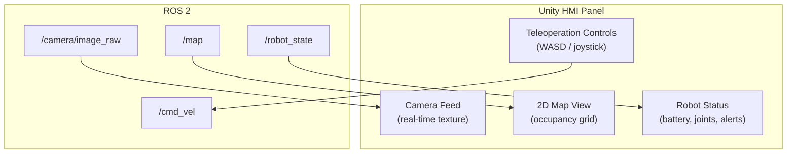

# Chapter 3.2 — Unity for Robotics Visualisation

:::note Learning Objectives
After this chapter you will be able to:
- Explain why Unity is used alongside Gazebo for robotics development.
- Set up the Unity Robotics Hub and ROS-TCP Connector.
- Visualise robot state (joint states, transforms, sensor data) in Unity.
- Design a basic Human-Machine Interface (HMI) in Unity for robot teleoperation.
:::

---

## 1. Why Unity for Robotics?

Unity complements Gazebo: while Gazebo excels at **physics simulation**, Unity excels at **high-fidelity rendering**, **HMI development**, and **photorealistic synthetic data**.

| Capability | Gazebo | Unity |
|-----------|--------|-------|
| Physics accuracy | ★★★★★ | ★★★☆☆ |
| Rendering quality | ★★★☆☆ | ★★★★★ |
| HMI / UI tools | ★★☆☆☆ | ★★★★★ |
| Asset library | ★★★☆☆ | ★★★★★ (Asset Store) |
| ROS 2 integration | Native | Via ROS-TCP-Connector |
| Synthetic data (SDG) | Limited | ✓ (Perception package) |

:::info Use Cases
Unity is the preferred environment for:
- Operator HMI panels and dashboards
- Training scenario design (AR/VR teleop)
- Photorealistic synthetic image generation for perception training
- Demo visualisations for stakeholders
:::

---

## 2. Unity Robotics Hub

The **Unity Robotics Hub** is a collection of open-source packages maintained by Unity Technologies for robotics integration:



*Unity connects to ROS 2 via a TCP socket managed by the ROS-TCP-Connector (Unity side) and ROS-TCP-Endpoint (ROS 2 side).*

### Package Overview

| Package | Repository | Purpose |
|---------|-----------|---------|
| ROS-TCP-Connector | `Unity-Technologies/ROS-TCP-Connector` | Unity ↔ ROS 2 bridge |
| URDF-Importer | `Unity-Technologies/URDF-Importer` | Import URDF into Unity |
| Robotics-Nav2-SLAM | `Unity-Technologies/Robotics-Nav2-SLAM-Example` | Nav2 + Unity demo |
| Perception | `Unity-Technologies/com.unity.perception` | Synthetic data generation |

---

## 3. Setting Up the ROS-TCP Connector

### Step 1 — Install the Unity Package

In Unity Package Manager, add by URL:
```
https://github.com/Unity-Technologies/ROS-TCP-Connector.git?path=/com.unity.robotics.ros-tcp-connector
```

### Step 2 — Install the ROS 2 Endpoint

```bash
cd ~/ros2_ws/src
git clone https://github.com/Unity-Technologies/ROS-TCP-Endpoint.git
cd ~/ros2_ws && colcon build --packages-select ros_tcp_endpoint
source install/setup.bash
```

### Step 3 — Configure the Connection

In Unity, go to **Robotics → ROS Settings** and set:
- **Protocol:** ROS2
- **ROS IP Address:** 127.0.0.1 (or your ROS machine IP)
- **ROS Port:** 10000

Launch the endpoint in ROS 2:
```bash
ros2 run ros_tcp_endpoint default_server_endpoint --ros-args -p ROS_IP:=127.0.0.1
```

### Step 4 — Verify Connection

Unity logs `Connection to ROS established` in the Console when the endpoint is reachable.

---

## 4. Importing a Robot URDF

With the URDF Importer package installed:

1. Place your `.urdf` file and its mesh assets in `Assets/`
2. In Unity, right-click the `.urdf` → **Import Robot from URDF**
3. Adjust the **Axis Type** to **Y-axis** (Unity convention) or **Z-axis** (ROS convention)
4. The robot spawns in the scene with articulation bodies for each joint

:::warning Mesh Formats
Unity supports `.fbx`, `.obj`, and `.dae` meshes. If your URDF references `.STL` files, convert them to `.fbx` first using Blender (free) or Meshlab.
:::

---

## 5. Visualising Sensor Data in Unity

### Joint State Visualisation

```csharp
// JointStateSubscriber.cs
using Unity.Robotics.ROSTCPConnector;
using RosMessageTypes.Sensor;

public class JointStateSubscriber : MonoBehaviour
{
    ROSConnection ros;
    public ArticulationBody[] joints;

    void Start()
    {
        ros = ROSConnection.GetOrCreateInstance();
        ros.Subscribe<JointStateMsg>("/joint_states", OnJointState);
    }

    void OnJointState(JointStateMsg msg)
    {
        for (int i = 0; i < joints.Length; i++)
        {
            var drive = joints[i].xDrive;
            drive.target = (float)(msg.position[i] * Mathf.Rad2Deg);
            joints[i].xDrive = drive;
        }
    }
}
```

### Point Cloud Visualisation

Use the **PointCloud2 Visualizer** from the Robotics Hub or the open-source `pcx` Unity package to render real-time LiDAR point clouds as GPU particle systems.

---

## 6. HMI Design

A **Human-Machine Interface (HMI)** in Unity allows operators to monitor and control the robot through a polished graphical interface.



### Key UI Components

| Component | Unity Object | ROS Topic |
|-----------|-------------|-----------|
| Camera feed | `RawImage` with texture subscriber | `/camera/color/image_raw` |
| Map view | `RawImage` + OccupancyGrid decoder | `/map` |
| Battery gauge | `Slider` | `/battery_state` |
| Velocity control | `EventSystem` joystick | `/cmd_vel` |
| Emergency stop | `Button` → service call | `/emergency_stop` |

---

## Chapter Summary

:::tip Summary
- Unity excels at **high-fidelity rendering** and **HMI development** where Gazebo covers physics fidelity.
- The **ROS-TCP-Connector** bridges Unity and ROS 2 over a TCP socket — bidirectional, supporting all message types.
- **URDF-Importer** brings your robot model into Unity using Unity's ArticulationBody physics.
- A Unity **HMI panel** can aggregate camera feeds, maps, joint states, and teleoperation controls into a single operator interface.
:::

---

## Knowledge Check

1. What is the primary reason to use Unity alongside Gazebo, rather than replacing it?
2. What two components make up the ROS-TCP bridge?
3. Why might `.STL` meshes need to be converted before importing into Unity?
4. What ROS 2 message type represents joint angle positions?
5. Name three UI elements suitable for a robot operator HMI.

---

## Exercises

**Exercise 3.4 — URDF in Unity** *(Beginner)*
Import your Module 3.1 robot URDF into Unity. Publish joint states from a ROS 2 node at 30 Hz and verify the Unity robot model animates in real time.

**Exercise 3.5 — Live Camera Feed** *(Intermediate)*
Subscribe to a `/camera/color/image_raw` topic from a Gazebo simulation (or rosbag) in Unity and display the feed on a `RawImage` component. Overlay the current robot pose (from `/odom`) as a text label.

**Exercise 3.6 — Teleoperation HMI** *(Advanced)*
Build a full teleoperation panel in Unity: camera feed, 2D map, battery indicator, and a virtual joystick that publishes `geometry_msgs/Twist` to `/cmd_vel`. Drive the robot in Gazebo from the Unity HMI and record a 60-second demo clip.
