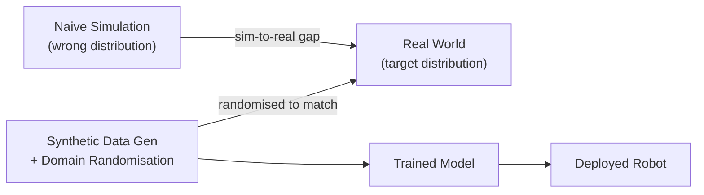
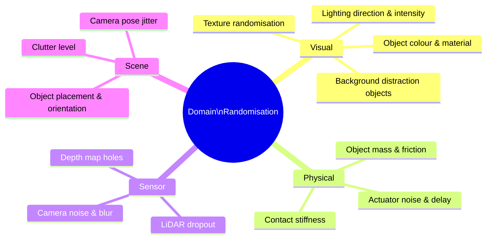
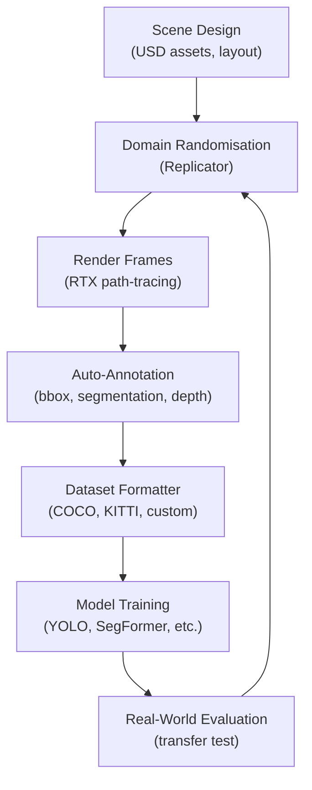

# Chapter 4.1 — Isaac Sim & Synthetic Data

:::note Learning Objectives
After this chapter you will be able to:
- Describe what NVIDIA Isaac Sim offers over open-source simulators.
- Explain synthetic data generation (SDG) and its role in training perception models.
- Define domain randomisation and list its key parameters.
- Use the Isaac Sim Replicator API to generate an annotated image dataset.
:::

---

## 1. NVIDIA Isaac Sim

**Isaac Sim** is NVIDIA's GPU-accelerated robotics simulator, built on the **Omniverse** platform. It uses **USD (Universal Scene Description)** as its scene format and **PhysX 5** for physics.

| Feature | Isaac Sim | Gazebo Harmonic |
|---------|-----------|-----------------|
| Renderer | RTX path-tracing | OGRE 2 |
| Physics | PhysX 5 (GPU) | DART / Bullet |
| Sensor fidelity | Photorealistic + noise models | Basic models |
| Synthetic data | Full Replicator pipeline | Limited |
| Hardware requirement | NVIDIA RTX GPU | Any GPU |
| ROS 2 integration | Native (Isaac ROS bridge) | `ros_gz_bridge` |

:::warning Hardware Requirement
Isaac Sim requires an **NVIDIA RTX GPU** (RTX 2070 or better; RTX 4090 recommended for production). It does not run on AMD or Intel integrated graphics. A cloud-based Isaac Sim instance via NVIDIA Omniverse Cloud is available for GPU-less development machines.
:::

---

## 2. The Sim-to-Real Problem

Neural networks trained on real images **fail when deployed in environments different from training data**. Synthetic data addresses this — but naive synthetic data creates a different distribution from reality.



*Domain randomisation expands the training distribution to cover the real-world distribution.*

---

## 3. Synthetic Data Generation (SDG)

**Synthetic Data Generation** is the process of rendering annotated images, depth maps, and semantic labels from a simulated scene. These become training data for perception models (object detection, segmentation, pose estimation).

### Advantages over Real Data

| Aspect | Real Data | Synthetic Data |
|--------|-----------|---------------|
| Annotation cost | High (manual labelling) | Zero (auto-generated) |
| Edge case coverage | Requires rare events | Fully controllable |
| Privacy | May contain people/IP | No privacy concerns |
| Scale | Limited by collection time | Unlimited |
| Ground truth | Approximate | Pixel-perfect |

### Data Types Isaac Sim Can Generate

- **RGB images** (photorealistic, with RTX lighting)
- **Depth maps** (metric, simulated sensor noise)
- **Semantic segmentation** (per-pixel class labels)
- **Instance segmentation** (per-object unique ID)
- **2D / 3D bounding boxes**
- **Keypoints** (e.g., joint positions for pose estimation)
- **Normals** and **optical flow**

---

## 4. Domain Randomisation

**Domain randomisation** deliberately varies simulation parameters so the trained model learns features that generalise to the real world, rather than overfitting to a specific simulated appearance.



### Randomisation Levels

| Level | Description | Example |
|-------|-------------|---------|
| Weak | Small perturbations around a reference | ±10% lighting |
| Moderate | Full scene texture/lighting randomisation | Any texture on any object |
| Strong | Physics and camera parameter randomisation | Random sensor noise |

:::tip Start Weak, Then Increase
Begin with weak randomisation. If the trained model transfers well to the real environment, you may not need strong randomisation. Excessive randomisation can make training harder without improving transfer.
:::

---

## 5. The Replicator API

Isaac Sim's **Replicator** is a Python API for scripting SDG pipelines:

```python
import omni.replicator.core as rep

# Create a scene
with rep.new_layer():
    # Add a table surface
    table = rep.create.cube(scale=(1.0, 0.02, 0.6))

    # Randomise 5 objects on the table
    objects = rep.create.from_usd(
        "omniverse://localhost/Library/Props/Mug/mug.usd",
        count=5
    )

    with rep.randomizer.register(rep.randomizer.scatter_2d(table)):
        pass

    # Randomise lighting
    lights = rep.create.light(light_type="Sphere", count=3)
    with rep.randomizer.register(rep.randomizer.light_colors(lights)):
        rep.modify.pose(
            position=rep.distribution.uniform((-5, 5, 0), (5, 5, 10))
        )

    # Randomise textures on all objects
    with rep.randomizer.register(rep.randomizer.textures(objects)):
        rep.modify.texture(
            textures=rep.utils.get_usd_files("omniverse://localhost/Library/Textures")
        )

# Configure output writer
writer = rep.WriterRegistry.get("BasicWriter")
writer.initialize(
    output_dir="./synthetic_dataset",
    rgb=True,
    bounding_box_2d_tight=True,
    semantic_segmentation=True,
    depth=True,
)
writer.attach([rep.create.render_product("/OmniverseKit_Persp", (1280, 720))])

# Generate 1000 frames
with rep.trigger.on_frame(num_frames=1000):
    rep.orchestrator.run()
```

---

## 6. Training Data Pipeline



*The pipeline is iterative: evaluate transfer, then adjust randomisation parameters.*

### Output Formats

Isaac Sim Replicator can write to standard dataset formats:

| Format | Use Case |
|--------|----------|
| COCO JSON | Object detection, instance segmentation |
| KITTI | Autonomous driving datasets |
| Pascal VOC | Classification + detection |
| Custom HDF5 | Robotics training pipelines |

---

## Chapter Summary

:::tip Summary
- **Isaac Sim** is NVIDIA's photorealistic, GPU-accelerated simulator with full synthetic data capabilities — at the cost of requiring an RTX GPU.
- **Synthetic data** provides unlimited annotated training data at zero labelling cost.
- **Domain randomisation** — varying textures, lighting, physics, and sensor parameters — bridges the sim-to-real gap.
- The **Replicator API** scripted in Python automates the full SDG pipeline, from scene setup to dataset export.
:::

---

## Knowledge Check

1. What GPU architecture does Isaac Sim require, and why?
2. Name three types of annotations Isaac Sim can auto-generate.
3. What is the purpose of domain randomisation in a synthetic data pipeline?
4. Which Replicator class handles writing images and annotations to disk?
5. At what stage in the SDG pipeline does "dataset formatting" occur?

---

## Exercises

**Exercise 4.1 — First SDG Run** *(Beginner)*
Open Isaac Sim and use the built-in Replicator GUI (Replicator → Synthetic Data Generation) to generate a 100-frame dataset of a single object with three light randomisation parameters. Inspect the output folder structure.

**Exercise 4.2 — Scripted Randomisation** *(Intermediate)*
Adapt the Replicator Python example above to place between 3 and 8 objects (random count) on the table, use 5 different USD meshes, and generate 500 frames. Confirm bounding box annotations are correct by overlaying them on 10 sample images.

**Exercise 4.3 — Transfer Test** *(Advanced)*
Train a YOLOv8 model on a 2000-frame Isaac Sim synthetic dataset of a household object. Evaluate it on 100 real photographs of the same object. Report mAP@0.5 for synthetic test data vs. real data. Propose one randomisation change to improve transfer.
