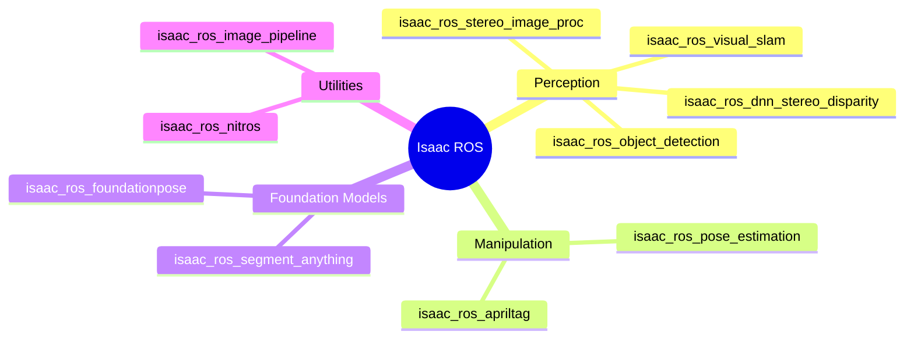
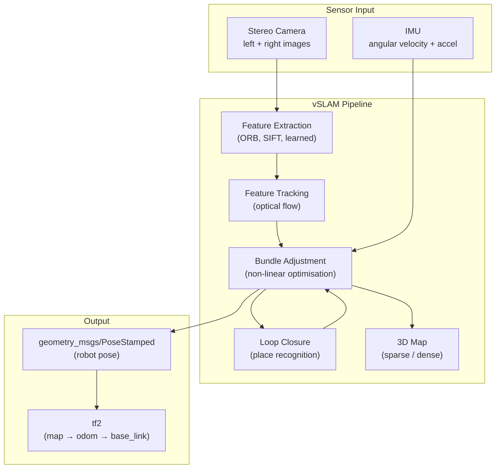
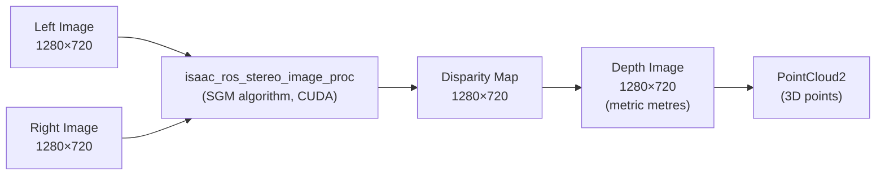
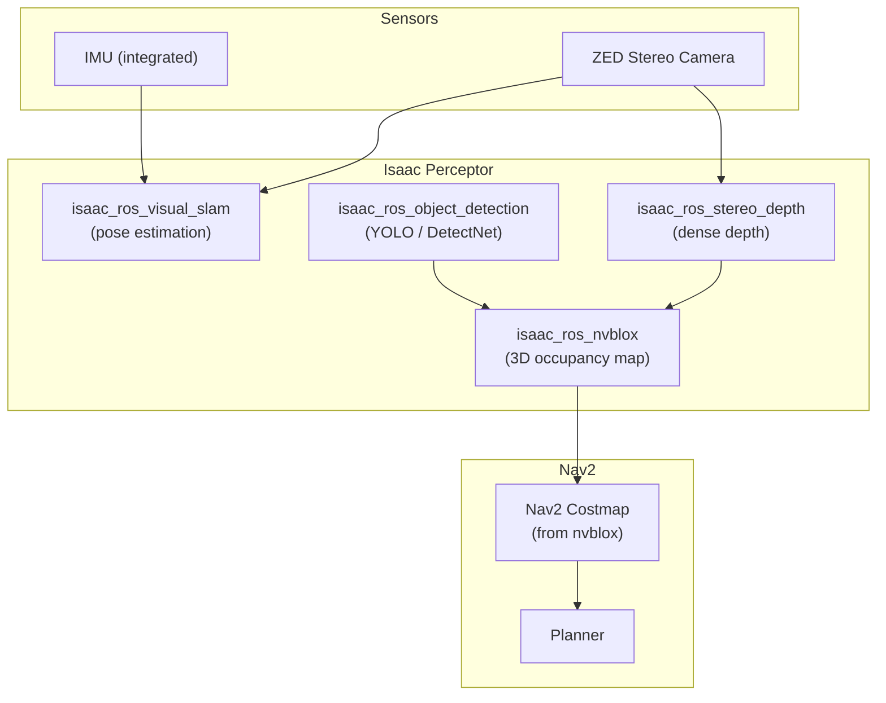

# Chapter 4.2 — Isaac ROS & Visual SLAM

:::note Learning Objectives
After this chapter you will be able to:
- Explain what Isaac ROS is and how it differs from standard ROS 2.
- Describe how Visual SLAM builds a map and estimates pose simultaneously.
- Configure and launch `isaac_ros_visual_slam` in a simulated environment.
- Understand the Isaac Perceptor stack and its role in humanoid perception.
:::

---

## 1. Isaac ROS

**Isaac ROS** is a collection of NVIDIA-accelerated ROS 2 packages that run perception workloads on the **CUDA** and **TensorRT** pipelines of NVIDIA GPUs and Jetson edge devices.

Key differences from standard ROS 2:

| Feature | Standard ROS 2 | Isaac ROS |
|---------|---------------|-----------|
| Execution | CPU-only | GPU + CPU (CUDA) |
| Throughput | ~30 Hz for complex tasks | 120+ Hz on Jetson AGX |
| Latency | Variable | Optimised, deterministic |
| Model format | Any | TensorRT (`.engine`) |
| Hardware | Any | NVIDIA GPU / Jetson |

### Isaac ROS Package Categories



### NITROS — Zero-Copy Transport

All Isaac ROS packages use **NITROS (NVIDIA Isaac Transport for ROS)** — a zero-copy memory bridge that eliminates CPU overhead when moving data between ROS 2 topics and GPU memory:

```
Standard ROS 2:  GPU → CPU memcpy → ROS topic → CPU → GPU  (slow)
Isaac ROS NITROS: GPU → NITROS bridge → GPU  (fast, zero-copy)
```

---

## 2. Visual SLAM

**Visual SLAM (Simultaneous Localisation and Mapping)** estimates the robot's pose (position + orientation) while building a map of the environment — using only camera images (no LiDAR required).



*Visual SLAM fuses stereo images and IMU to track pose and build a sparse 3D map.*

### Comparison: vSLAM vs LiDAR SLAM

| Aspect | Visual SLAM | LiDAR SLAM |
|--------|-------------|-----------|
| Sensor cost | Low (stereo camera ~$150) | High (3D LiDAR ~$2000+) |
| Performance in darkness | Poor | Unaffected |
| Performance in texture-less areas | Poor (corridors) | Good |
| Computational load | High (image processing) | Moderate |
| Map density | Sparse or semi-dense | Dense |
| Outdoor performance | Good | Excellent |

---

## 3. `isaac_ros_visual_slam` Setup

### Installation

```bash
# Install Isaac ROS apt repository
wget -qO - https://isaac.download.nvidia.com/isaac-ros/repos.key | sudo apt-key add -
sudo apt install ros-humble-isaac-ros-visual-slam

# Or from source
cd ~/ros2_ws/src
git clone --recurse-submodules https://github.com/NVIDIA-ISAAC-ROS/isaac_ros_visual_slam.git
```

### Launch File

```python
# vslam_launch.py
from launch import LaunchDescription
from launch_ros.actions import Node
from launch.actions import DeclareLaunchArgument

def generate_launch_description():
    return LaunchDescription([
        Node(
            package='isaac_ros_visual_slam',
            executable='isaac_ros_visual_slam_node',
            name='visual_slam_node',
            parameters=[{
                # Stereo camera input topics
                'left_image_topic': '/left/image_rect',
                'right_image_topic': '/right/image_rect',
                'left_camera_info_topic': '/left/camera_info',
                'right_camera_info_topic': '/right/camera_info',
                # IMU integration
                'imu_topic': '/imu/data',
                'enable_imu_fusion': True,
                # Output frames
                'odom_frame': 'odom',
                'base_frame': 'base_link',
                'map_frame': 'map',
            }],
            remappings=[],
        ),
    ])
```

### Output Topics

| Topic | Type | Description |
|-------|------|-------------|
| `/visual_slam/tracking/odometry` | `nav_msgs/Odometry` | Robot odometry |
| `/visual_slam/tracking/vo_pose_covariance` | `geometry_msgs/PoseWithCovarianceStamped` | Pose with uncertainty |
| `/visual_slam/map/landmarks` | `sensor_msgs/PointCloud2` | Sparse 3D map |
| `/visual_slam/status` | `isaac_ros_visual_slam_interfaces/VisualSlamStatus` | Tracking quality |

---

## 4. Stereo Depth Estimation

Isaac ROS provides GPU-accelerated stereo disparity computation:



The **SGM (Semi-Global Matching)** algorithm runs on CUDA and produces dense disparity at 120 Hz on a Jetson AGX Orin.

```bash
# Launch stereo depth
ros2 launch isaac_ros_stereo_image_proc isaac_ros_stereo_image_pipeline.launch.py \
  left_image_topic:=/zed/left/image_rect_color \
  right_image_topic:=/zed/right/image_rect_color
```

---

## 5. Isaac Perceptor Stack

**Isaac Perceptor** is NVIDIA's reference perception stack for autonomous mobile robots, combining vSLAM, stereo depth, and object detection into a pre-configured, production-grade pipeline:



*Isaac Perceptor feeds a 3D occupancy map (nvblox) directly into Nav2 costmaps, enabling obstacle-aware navigation at camera-frame rates.*

---

## Chapter Summary

:::tip Summary
- **Isaac ROS** provides GPU-accelerated ROS 2 packages with zero-copy NITROS transport — dramatically reducing perception latency on NVIDIA hardware.
- **Visual SLAM** estimates pose and builds a map from stereo camera images and IMU alone — no expensive LiDAR required.
- `isaac_ros_visual_slam` is configurable via ROS 2 parameters and integrates directly with Nav2 via standard `tf2` frames.
- **Isaac Perceptor** stacks vSLAM + stereo depth + nvblox into a production-ready perception pipeline for autonomous mobile humanoids.
:::

---

## Knowledge Check

1. What does NITROS do, and why does it improve Isaac ROS performance?
2. Name two scenarios where visual SLAM degrades but LiDAR SLAM performs well.
3. What are the two sensor inputs required by `isaac_ros_visual_slam`?
4. What is nvblox and how does it connect to Nav2?
5. What output topic provides the robot's odometry from the vSLAM node?

---

## Exercises

**Exercise 4.4 — vSLAM in Isaac Sim** *(Intermediate)*
In Isaac Sim, spawn a robot with a stereo camera and IMU. Launch `isaac_ros_visual_slam` and drive the robot through an indoor scene. Visualise the sparse map landmarks in RViz2 and record the accumulated drift after a 2-minute traversal.

**Exercise 4.5 — Stereo Depth Pipeline** *(Intermediate)*
Configure `isaac_ros_stereo_image_proc` with a calibrated stereo camera (real or simulated). Compare the depth image from the stereo pipeline with the ground-truth depth from Isaac Sim on 20 test frames. Report mean absolute depth error at 1 m, 3 m, and 5 m.

**Exercise 4.6 — Full Perceptor Integration** *(Advanced)*
Integrate Isaac Perceptor (vSLAM + nvblox) with Nav2 in Isaac Sim. Demonstrate autonomous navigation in a cluttered room where no pre-built map exists. The robot must: start, build a map, navigate to a goal 5 m away, and return to the start — all autonomously.
