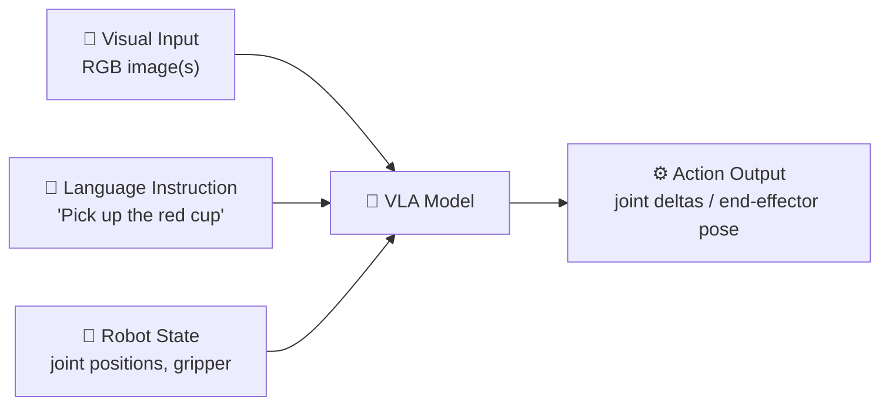
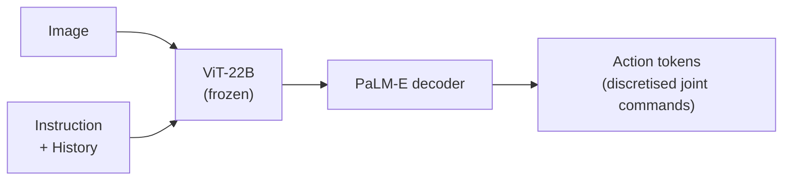
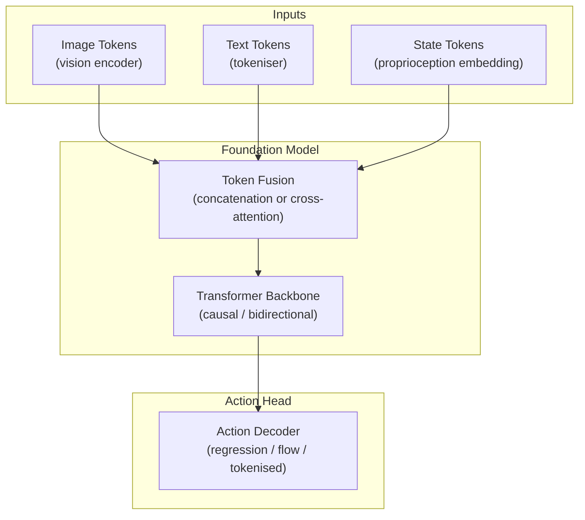
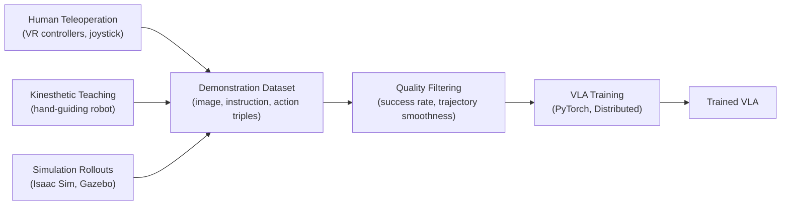
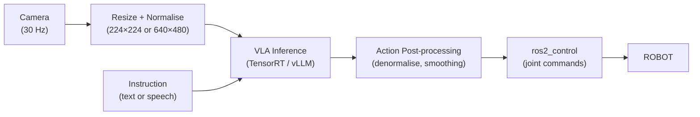

# Chapter 5.1 — Vision-Language-Action Models

:::note Learning Objectives
After this chapter you will be able to:
- Define a Vision-Language-Action (VLA) model and contrast it with earlier robot learning approaches.
- Describe the architectures of π0, RT-2, and OpenVLA.
- Explain what robot foundation models are and how they differ from task-specific policies.
- Outline the data requirements and training pipeline for a VLA.
- Identify deployment constraints for VLA inference on edge hardware.
:::

---

## 1. What Is a VLA Model?

A **Vision-Language-Action (VLA)** model is a neural network that takes **visual observations** and **language instructions** as input, and outputs **robot action commands** (joint positions, velocities, or end-effector poses).

*A VLA model unifies vision, language understanding, and motor control into a single end-to-end model.*

### Evolution of Robot Learning

| Era | Approach | Limitation |
|-----|----------|-----------|
| Pre-2015 | Hand-coded behaviours | Brittle, task-specific |
| 2015–2020 | Task-specific deep RL | Sample-inefficient, no generalisation |
| 2020–2022 | Imitation learning (BC) | Requires large human demonstrations |
| 2022–present | Foundation model + fine-tuning | **VLA era** — generalises across tasks |

---

## 2. Key VLA Models

### π0 (Physical Intelligence, 2024)

**π0** (pi-zero) is a general-purpose robot foundation model from Physical Intelligence. It uses a **flow matching** architecture trained on a large, diverse dataset of robot demonstrations across multiple embodiments.

| Property | π0 |
|----------|-----|
| Backbone | VLM (PaliGemma) + flow matching head |
| Input | Images + language instruction + proprioception |
| Output | Action chunk (7-DOF delta poses, 50 Hz) |
| Training data | 10,000+ hours across 6 robot types |
| Inference latency | ~50 ms (A100 GPU) |

### RT-2 (Google DeepMind, 2023)

**Robotic Transformer 2 (RT-2)** casts robot actions as **text tokens** — repurposing a large vision-language model (PaLI-X) to output action sequences in the same autoregressive framework as text generation.

*RT-2 outputs robot actions as discretised text tokens using the same LLM decoder as language generation.*

Key insight: because the backbone is pre-trained on internet-scale data, RT-2 exhibits **emergent reasoning** — it can follow instructions like "move the robot to the item that represents an energy source" without task-specific training.

### OpenVLA (Stanford, 2024)

**OpenVLA** is a fully open-source VLA model based on **Llama 2 + DINOv2**, released with weights, training code, and dataset. It achieves competitive performance with RT-2 at a fraction of the computational cost.

| Property | OpenVLA |
|----------|---------|
| Language model | Llama 2 7B |
| Vision encoder | DINOv2 + SigLIP |
| Parameters | 7.5B |
| Training data | Open X-Embodiment (970k episodes) |
| License | Apache 2.0 |

---

## 3. Architecture Deep Dive

All major VLA models share a common structure:

### Action Representation Strategies

| Strategy | Model | Pros | Cons |
|----------|-------|------|------|
| Discretised tokens | RT-2 | Reuses LLM decoder | Low resolution |
| Continuous regression | BC-Z | High resolution | Simple distribution |
| Diffusion / flow matching | π0, Diffusion Policy | Multi-modal, smooth | High compute |
| Chunk prediction | ACT | Reduces jitter | Fixed horizon |

---

## 4. Training Data

VLA models require **large, diverse robot demonstration data** — typically collected via teleoperation or kinesthetic teaching:

**Open X-Embodiment** is the largest open dataset, containing 970k+ robot episodes across 22 robot types — the dataset used to train OpenVLA.

:::warning Data Scale
Training a VLA from scratch requires millions of demonstration episodes and months of GPU time. In practice, **fine-tune a pre-trained VLA** on your robot-specific data (100–1000 demos is sufficient for specialised tasks).
:::

---

## 5. Deployment on Physical Robots

### Inference Stack

### Latency Requirements

| Control mode | Max inference latency |
|-------------|----------------------|
| Whole-body locomotion | 5–20 ms |
| Arm manipulation | 20–100 ms |
| High-level task planning | 500 ms–2 s |

:::tip Quantisation
Use **INT8 quantisation** with TensorRT to reduce VLA inference latency by 2–4× with minimal accuracy loss. For OpenVLA (7B params), this reduces VRAM from ~16 GB to ~6 GB — enabling deployment on a Jetson AGX Orin.
:::

---

## Chapter Summary

:::tip Summary
- VLA models unify vision, language, and action into a single end-to-end model, enabling language-conditioned robot control that generalises across tasks.
- **π0** uses flow matching; **RT-2** discretises actions as text tokens; **OpenVLA** is fully open-source with Apache 2.0 weights.
- Training requires large demonstration datasets; **fine-tuning** a pre-trained VLA on task-specific data is far more practical than training from scratch.
- Deployment requires INT8 quantisation and TensorRT for real-time inference on edge hardware.
:::

---

## Knowledge Check

1. What are the three input modalities of a VLA model?
2. How does RT-2 represent robot actions, and why is this architecturally significant?
3. What is the Open X-Embodiment dataset and why is it important for VLA research?
4. Why is fine-tuning preferred over training a VLA from scratch?
5. What technique is used to fit a 7B-parameter VLA into 6 GB of VRAM?

---

## Exercises

**Exercise 5.1 — VLA Comparison Table** *(Beginner)*
Research π0, RT-2, OpenVLA, and Octo. Build a table comparing: parameters, action head type, training dataset, license, and hardware requirements. Identify which is most suitable for a low-cost research robot.

**Exercise 5.2 — OpenVLA Inference** *(Intermediate)*
Download the OpenVLA weights (HuggingFace: `openvla/openvla-7b`). Load the model in Python and run inference on a test image with the instruction "pick up the bottle". Print the output action tokens and decode them to joint delta values.

**Exercise 5.3 — Fine-Tuning on 100 Demos** *(Advanced)*
Collect 100 teleoperation demonstrations in Isaac Sim for a single pick-and-place task. Fine-tune OpenVLA using LoRA for 3 epochs. Evaluate success rate on 20 held-out test scenarios. Compare to the zero-shot baseline.
