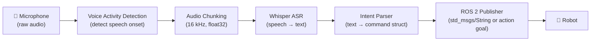
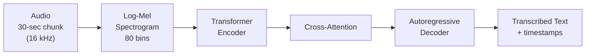

# Chapter 5.2 — Voice-to-Action with Whisper

:::note Learning Objectives
After this chapter you will be able to:
- Explain how Whisper performs speech recognition and its model size trade-offs.
- Build a real-time microphone → transcription pipeline in Python.
- Parse free-form transcribed text into structured robot commands.
- Publish parsed commands as ROS 2 `std_msgs/String` or custom action goals.
:::

---

## 1. Speech Recognition in Robotics

Natural language is the most intuitive way for humans to instruct robots. A voice interface transforms unstructured speech into structured commands that the robot can act on.



*The full voice-to-action pipeline: microphone input → speech recognition → intent parsing → robot command.*

---

## 2. OpenAI Whisper

**Whisper** is OpenAI's open-source automatic speech recognition (ASR) model. It is trained on 680,000 hours of multilingual audio from the internet and achieves near-human accuracy on clean speech.

### Model Sizes

| Model | Parameters | VRAM | Relative Speed | WER (English) |
|-------|-----------|------|----------------|---------------|
| tiny | 39M | 1 GB | 32× | ~5.7% |
| base | 74M | 1 GB | 16× | ~4.2% |
| small | 244M | 2 GB | 6× | ~3.0% |
| medium | 769M | 5 GB | 2× | ~2.4% |
| large-v3 | 1550M | 10 GB | 1× | ~2.0% |

:::tip Model Selection
For robotics, **`whisper-small`** provides the best latency/accuracy trade-off for English commands. Use **`whisper-base`** on Jetson Orin for real-time performance. Reserve `large-v3` for offline post-processing or multi-language environments.
:::

### Architecture

Whisper is a **sequence-to-sequence Transformer**:
- **Encoder:** Log-Mel spectrogram → dense audio features
- **Decoder:** Autoregressive generation of text tokens



---

## 3. Real-Time Transcription Pipeline

Whisper's design processes **30-second audio chunks** — not streaming. For real-time robotics, we use a **sliding window** approach with **Voice Activity Detection (VAD)** to segment audio:

### Dependencies

```bash
pip install openai-whisper pyaudio silero-vad torch
```

### VAD + Whisper Pipeline

```python
import whisper
import pyaudio
import numpy as np
import torch

class RealtimeWhisper:
    def __init__(self, model_size="small"):
        self.model = whisper.load_model(model_size)
        self.sample_rate = 16000
        self.chunk_size = 1024
        self.buffer = []
        self.silence_threshold = 0.01
        self.min_speech_duration = 0.5  # seconds

    def record_chunk(self) -> np.ndarray:
        """Record audio until a pause is detected."""
        p = pyaudio.PyAudio()
        stream = p.open(
            format=pyaudio.paFloat32,
            channels=1,
            rate=self.sample_rate,
            input=True,
            frames_per_buffer=self.chunk_size,
        )
        frames = []
        silent_chunks = 0
        speaking = False

        print("🎤 Listening...")
        while True:
            data = stream.read(self.chunk_size)
            audio = np.frombuffer(data, dtype=np.float32)
            frames.append(audio)

            rms = float(np.sqrt(np.mean(audio**2)))
            if rms > self.silence_threshold:
                speaking = True
                silent_chunks = 0
            elif speaking:
                silent_chunks += 1
                if silent_chunks > 20:  # ~0.5s silence → end of utterance
                    break

        stream.stop_stream()
        stream.close()
        p.terminate()
        return np.concatenate(frames)

    def transcribe(self, audio: np.ndarray) -> str:
        result = self.model.transcribe(audio, language="en", fp16=torch.cuda.is_available())
        return result["text"].strip()

    def listen_and_transcribe(self) -> str:
        audio = self.record_chunk()
        return self.transcribe(audio)
```

---

## 4. Command Parsing

Raw transcription must be parsed into structured intent. Two approaches:

### Rule-Based Parser (Fast, Deterministic)

```python
import re
from dataclasses import dataclass
from typing import Optional

@dataclass
class RobotCommand:
    action: str                    # "navigate", "pick", "stop", "say"
    target: Optional[str] = None   # object or location name
    direction: Optional[str] = None
    raw_text: str = ""

PATTERNS = [
    (r"\b(go to|navigate to|move to)\s+(.+)", "navigate"),
    (r"\b(pick up|grab|take)\s+(.+)", "pick"),
    (r"\b(place|put|set down)\s+(.+)\s+(on|in|at)\s+(.+)", "place"),
    (r"\b(stop|halt|freeze|emergency stop)\b", "stop"),
    (r"\b(turn left|rotate left)\b", "turn_left"),
    (r"\b(turn right|rotate right)\b", "turn_right"),
]

def parse_command(text: str) -> RobotCommand:
    text_lower = text.lower().strip()
    for pattern, action in PATTERNS:
        match = re.search(pattern, text_lower)
        if match:
            target = match.group(2) if len(match.groups()) >= 2 else None
            return RobotCommand(action=action, target=target, raw_text=text)
    return RobotCommand(action="unknown", raw_text=text)
```

### LLM-Based Parser (Flexible, Context-Aware)

For open-vocabulary instructions, pass the transcription to an LLM (see Chapter 5.3):

```python
# Structured output via OpenAI / Ollama
from pydantic import BaseModel

class ParsedCommand(BaseModel):
    action: str
    target: str | None
    location: str | None
    confidence: float

# prompt = f"Parse this robot command into JSON: '{transcription}'"
```

---

## 5. ROS 2 Integration

```python
import rclpy
from rclpy.node import Node
from std_msgs.msg import String
from my_interfaces.msg import RobotCommandMsg

class VoiceCommandNode(Node):
    def __init__(self):
        super().__init__('voice_command_node')
        self.pub_raw = self.create_publisher(String, '/voice/transcription', 10)
        self.pub_cmd = self.create_publisher(RobotCommandMsg, '/voice/command', 10)
        self.asr = RealtimeWhisper(model_size='small')
        self.get_logger().info('Voice command node ready — speak a command.')
        self.listen_loop()

    def listen_loop(self):
        while rclpy.ok():
            text = self.asr.listen_and_transcribe()
            self.get_logger().info(f'Transcribed: "{text}"')

            # Publish raw transcription
            raw_msg = String()
            raw_msg.data = text
            self.pub_raw.publish(raw_msg)

            # Parse and publish structured command
            cmd = parse_command(text)
            cmd_msg = RobotCommandMsg()
            cmd_msg.action = cmd.action
            cmd_msg.target = cmd.target or ''
            cmd_msg.raw_text = text
            self.pub_cmd.publish(cmd_msg)
```

:::warning Microphone Latency on ROS 2
Run the microphone listener in a **separate thread** from the ROS 2 executor to prevent blocking `rclpy.spin()`. Use `threading.Thread` or an `AsyncIO` executor, not `create_timer`.
:::

---

## 6. Faster Whisper (Deployment Optimisation)

For production deployment, use **faster-whisper** — a CTranslate2-based reimplementation that is **2–4× faster** with lower memory:

```bash
pip install faster-whisper
```

```python
from faster_whisper import WhisperModel

model = WhisperModel("small", device="cuda", compute_type="int8")
segments, info = model.transcribe("audio.wav", beam_size=5)
text = " ".join(seg.text for seg in segments)
```

---

## Chapter Summary

:::tip Summary
- **Whisper** is an open-source ASR model trained on 680k hours of multilingual audio — accurate, multilingual, and freely available.
- For real-time robotics use **`whisper-small`** or **`whisper-base`** with VAD-based audio segmentation.
- **Rule-based parsers** are fast and predictable for known command vocabularies; **LLM parsers** handle open-vocabulary instructions (Chapter 5.3).
- Publish transcribed commands to ROS 2 topics for downstream nodes to consume — keeping the speech module decoupled from the planner.
:::

---

## Knowledge Check

1. Why does Whisper process 30-second chunks rather than streaming audio?
2. Which Whisper model size is recommended for real-time use on a Jetson Orin?
3. What is the role of Voice Activity Detection in the pipeline?
4. What is the difference between rule-based and LLM-based command parsing?
5. Why should the microphone listener run in a separate thread from `rclpy.spin()`?

---

## Exercises

**Exercise 5.4 — Transcription Node** *(Beginner)*
Write a ROS 2 node that uses `faster-whisper` to transcribe microphone input and publishes each utterance as `std_msgs/String` on `/voice/transcription`. Run it and speak 5 different robot commands; verify the output.

**Exercise 5.5 — Command Parser** *(Intermediate)*
Extend the node from Exercise 5.4 with a rule-based parser. Support at least 8 command patterns (navigate, pick, place, stop, turn left/right, wave, greet). Publish structured commands as a custom `RobotCommandMsg`. Test with 20 spoken inputs and report the parse success rate.

**Exercise 5.6 — End-to-End Voice Control** *(Advanced)*
Connect the voice command node to a Nav2 action client. When the user says "go to the desk", the robot should navigate to a pre-defined pose labelled "desk" in a YAML waypoint file. Demonstrate live with at least 3 different voice-triggered waypoints.
