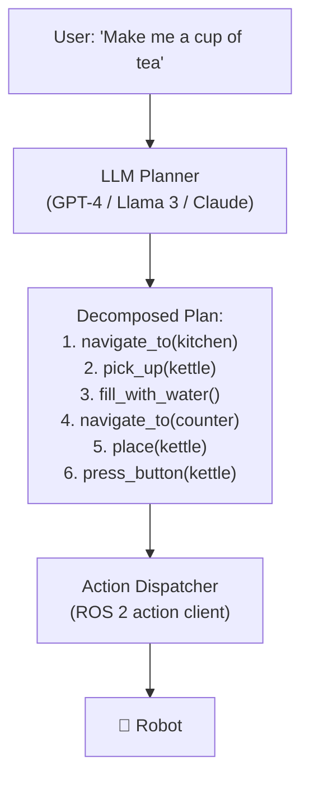
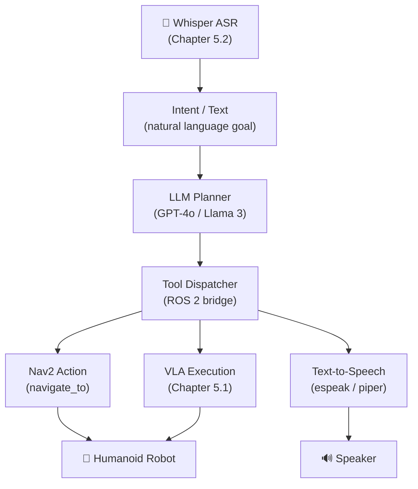

# Chapter 5.3 — LLM Task Planning → ROS 2

:::note Learning Objectives
After this chapter you will be able to:
- Explain how LLMs can act as high-level robot task planners.
- Implement OpenAI / Ollama tool-calling to produce structured robot action sequences.
- Build a LangChain agent with ROS 2 tool wrappers.
- Decompose a natural-language task into primitive robot actions.
:::

---

## 1. LLMs as Robot Planners

Traditional robot planning uses symbolic AI (PDDL, state machines) or hand-coded decision trees. **LLMs change this**: their world knowledge and reasoning ability allow them to decompose arbitrary natural-language tasks into primitive robot actions — without explicit programming of every scenario.



*The LLM converts a high-level goal into a sequence of primitive robot actions that the dispatcher executes via ROS 2.*

### LLM Planning vs VLA

| Aspect | LLM Planning (Ch 5.3) | VLA Models (Ch 5.1) |
|--------|-----------------------|--------------------|
| Abstraction level | High (task decomposition) | Low (joint commands) |
| Latency | 500 ms – 2 s | 20–100 ms |
| Generality | Extremely broad | Broad within training distribution |
| Execution | Via action dispatcher | Direct motor control |
| Best used for | Multi-step task orchestration | Real-time manipulation |

:::tip Use Both Together
The modern pattern is a **hierarchical system**: an LLM plans the task sequence (high-level), while a VLA model executes each primitive step (low-level). LLM says "pick up the cup"; VLA generates the joint trajectories to do it.
:::

---

## 2. Tool Calling

**Tool calling** (function calling) is the mechanism by which LLMs invoke external functions. The developer defines a schema for each available function; the LLM decides when and how to call them.

### Defining Tools for a Robot

```python
ROBOT_TOOLS = [
    {
        "type": "function",
        "function": {
            "name": "navigate_to",
            "description": "Navigate the robot to a named location or (x, y) coordinate.",
            "parameters": {
                "type": "object",
                "properties": {
                    "location": {
                        "type": "string",
                        "description": "Named waypoint (e.g. 'kitchen', 'charging_dock') or 'x,y' coords."
                    },
                    "speed": {
                        "type": "number",
                        "description": "Navigation speed limit in m/s (default 0.5)."
                    }
                },
                "required": ["location"]
            }
        }
    },
    {
        "type": "function",
        "function": {
            "name": "pick_object",
            "description": "Pick up a named object using the robot arm.",
            "parameters": {
                "type": "object",
                "properties": {
                    "object_name": {"type": "string"}
                },
                "required": ["object_name"]
            }
        }
    },
    {
        "type": "function",
        "function": {
            "name": "speak",
            "description": "Make the robot say a phrase aloud via text-to-speech.",
            "parameters": {
                "type": "object",
                "properties": {
                    "phrase": {"type": "string"}
                },
                "required": ["phrase"]
            }
        }
    }
]
```

### LLM Planning Loop

```python
import json
from openai import OpenAI   # or use Ollama with openai-compatible API

client = OpenAI()

def run_robot_planner(user_task: str, robot_state: dict):
    system_prompt = """You are a robot task planner. Decompose user tasks into sequences of tool calls.
    Always verify with a 'speak' call before and after executing physical actions.
    Only use available tools. If a task is impossible, say so."""

    messages = [
        {"role": "system", "content": system_prompt},
        {"role": "user", "content": f"Task: {user_task}\nRobot state: {json.dumps(robot_state)}"}
    ]

    while True:
        response = client.chat.completions.create(
            model="gpt-4o",
            messages=messages,
            tools=ROBOT_TOOLS,
            tool_choice="auto"
        )
        msg = response.choices[0].message

        if msg.tool_calls:
            messages.append(msg)
            for tc in msg.tool_calls:
                result = execute_tool(tc.function.name, json.loads(tc.function.arguments))
                messages.append({
                    "role": "tool",
                    "tool_call_id": tc.id,
                    "content": json.dumps(result)
                })
        else:
            print(f"Planner finished: {msg.content}")
            break
```

---

## 3. Tool Execution Bridge (ROS 2)

Each tool definition maps to a **ROS 2 action call** or **service call**:

```python
import rclpy
from rclpy.action import ActionClient
from nav2_msgs.action import NavigateToPose
from geometry_msgs.msg import PoseStamped

# Waypoint registry
WAYPOINTS = {
    "kitchen":      (3.5,  1.2, 0.0),
    "living_room":  (0.5, -1.0, 0.0),
    "charging_dock": (-1.0, 0.0, 0.0),
}

def execute_tool(name: str, args: dict) -> dict:
    """Route LLM tool calls to ROS 2 action/service calls."""

    if name == "navigate_to":
        location = args["location"]
        if location in WAYPOINTS:
            x, y, yaw = WAYPOINTS[location]
        else:
            # Parse "x,y" string
            x, y = map(float, location.split(","))
            yaw = 0.0

        success = ros2_navigate(x, y, yaw)
        return {"success": success, "reached": location}

    elif name == "pick_object":
        success = ros2_pick_object(args["object_name"])
        return {"success": success, "object": args["object_name"]}

    elif name == "speak":
        ros2_text_to_speech(args["phrase"])
        return {"success": True}

    return {"error": f"Unknown tool: {name}"}
```

---

## 4. Local LLMs with Ollama

For production robots, avoid cloud API dependency — use a **local LLM** with the **Ollama** server:

```bash
# Install Ollama
curl -fsSL https://ollama.com/install.sh | sh

# Pull a capable small model
ollama pull llama3.2:3b       # fast, fits Jetson AGX Orin
ollama pull qwen2.5:7b        # better reasoning, needs more VRAM
```

```python
from openai import OpenAI

# Ollama exposes an OpenAI-compatible API
client = OpenAI(base_url="http://localhost:11434/v1", api_key="ollama")

response = client.chat.completions.create(
    model="llama3.2:3b",
    messages=[{"role": "user", "content": "Navigate to the kitchen and pick up the cup."}],
    tools=ROBOT_TOOLS,
)
```

:::note Ollama on Jetson
Llama 3.2 (3B) runs at ~15 tokens/second on a Jetson AGX Orin in INT4, which is fast enough for task planning latency. Use `ollama run llama3.2:3b --gpu` to force GPU offload.
:::

---

## 5. Full Integration Architecture



*Full stack: voice input → LLM planning → ROS 2 tool dispatch → Nav2 + VLA execution.*

---

## Chapter Summary

:::tip Summary
- LLMs act as **high-level task planners**: they decompose natural language goals into sequences of primitive robot actions via tool-calling.
- **Tool calling** maps LLM function invocations to ROS 2 action and service calls.
- **Local LLMs** (Llama 3, Qwen 2.5 via Ollama) eliminate cloud dependency for production deployment on edge hardware.
- The full system is hierarchical: LLM handles task decomposition, VLA handles real-time execution.
:::

---

## Knowledge Check

1. What is tool calling and how does an LLM decide when to invoke a tool?
2. What is the planning latency of an LLM planner and is it suitable for real-time joint control?
3. How does LLM planning differ from a VLA model in terms of abstraction level?
4. What is the advantage of using Ollama over a cloud API in a deployed robot?
5. In the `execute_tool` function, what happens when a location is not in the `WAYPOINTS` registry?

---

## Exercises

**Exercise 5.7 — Tool Registry** *(Beginner)*
Define a tool registry with 6 robot actions (navigate, pick, place, speak, dock, wave). Manually call the OpenAI (or Ollama) API with the prompt "bring me the newspaper from the study" and print the full sequence of tool calls the LLM generates.

**Exercise 5.8 — ROS 2 Dispatcher** *(Intermediate)*
Implement the `execute_tool` function with real ROS 2 calls for `navigate_to` and `speak`. Wire it to the LLM planning loop. Demonstrate a two-step task ("go to the desk and say hello") executing end-to-end in simulation.

**Exercise 5.9 — Hierarchical VLA + LLM** *(Advanced)*
Combine Chapter 5.3 (LLM planner) and Chapter 5.1 (OpenVLA). When the LLM calls `pick_object(name)`, forward the object name to OpenVLA as a language instruction and use the VLA output as the joint trajectory. Demonstrate picking 3 different objects from natural language commands.
