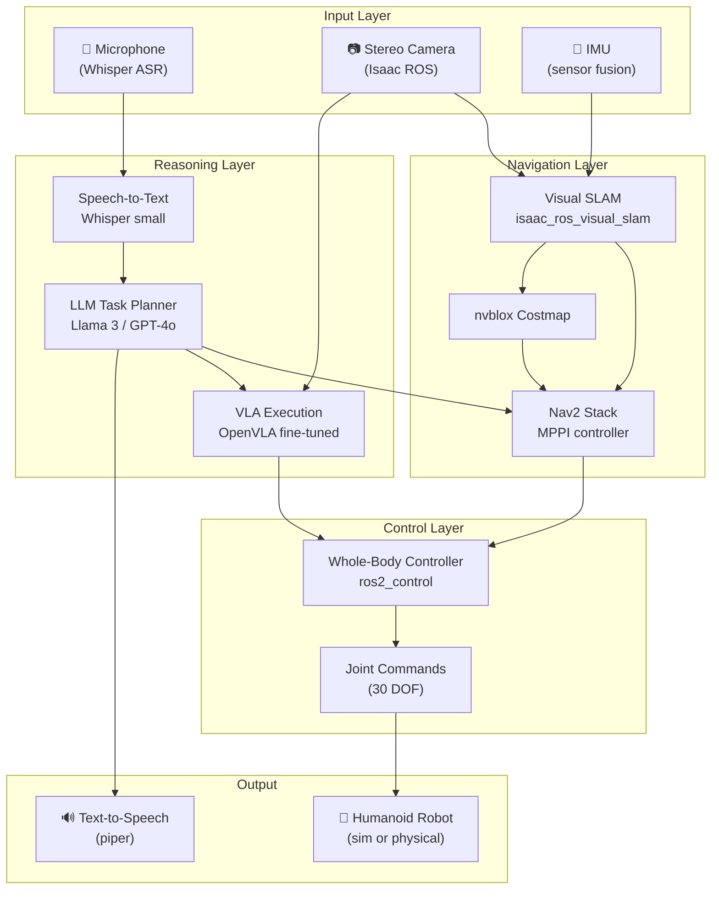

# Chapter 6.1 — Capstone: Autonomous Humanoid Robot

:::note Project Overview
Build a fully autonomous humanoid robot system that:
1. Navigates to a user-specified location using voice commands.
2. Identifies and picks up a designated object using a VLA model.
3. Returns to the start position and announces task completion.

This project integrates every module in the textbook into a single end-to-end demo.
:::

---

## 1. System Architecture



*Full system architecture for the capstone. Each box maps to a chapter in this textbook.*

---

## 2. Project Specification

### Task Description

The robot must autonomously complete the following **three-phase task**:

| Phase | Task | Success Criterion |
|-------|------|------------------|
| 1. Receive | User speaks a target object name and goal location | Correctly parsed by LLM planner |
| 2. Navigate & Grasp | Robot navigates to location, identifies and picks object | Object lifted off surface, no collisions |
| 3. Return & Report | Robot returns to origin, places object, announces done | Object placed, TTS confirmation heard |

### Environment

| Parameter | Value |
|-----------|-------|
| Arena size | 4 m × 4 m (simulated or physical) |
| Objects | 3–5 common household objects |
| Starting pose | Known, fixed, pre-configured in map |
| Map | Unknown at start — built during run (SLAM) |
| Lighting | Controlled indoor lighting |

:::warning Safety Requirements
For physical robot deployment:
- A human operator **must** be present with an emergency stop controller at all times.
- Maximum navigation speed: **0.3 m/s**
- Maximum arm velocity: **0.5 rad/s per joint**
- All autonomous operation must be gated by a **hardware emergency stop button**
:::

---

## 3. Development Milestones

| Milestone | Deliverable | Module(s) |
|-----------|-------------|-----------|
| M1 — Environment Setup | Gazebo world + robot URDF + ROS 2 workspace running | 2, 3 |
| M2 — Navigation | Robot navigates to 3 waypoints via Nav2 (no speech) | 2, 4 |
| M3 — Perception | Visual SLAM running; 3D map of arena generated | 4 |
| M4 — Voice Interface | Whisper transcribes commands; parsed to waypoints | 5.2 |
| M5 — LLM Planning | Full task decomposed by LLM and executed in sim | 5.3 |
| M6 — Manipulation | VLA picks target object (sim or mock real) | 5.1 |
| M7 — Integration | End-to-end: voice → navigate → pick → return → TTS | All |
| M8 — Demo | Live or recorded 5-minute autonomous run | All |

---

## 4. Technical Stack

```yaml
# capstone_stack.yaml
ros2:
  distro: humble
  packages:
    - isaac_ros_visual_slam
    - nav2_bringup
    - ros2_control
    - ros_gz_bridge

simulation:
  engine: gazebo_harmonic
  world: physai_arena.sdf
  robot: physai_humanoid.urdf

perception:
  slam: isaac_ros_visual_slam
  depth: isaac_ros_stereo_image_proc
  occupancy: nvblox

ai_stack:
  asr: faster-whisper small
  planner: ollama/llama3.2:3b
  vla: openvla-7b (fine-tuned)
  tts: piper (en_US-ryan-medium)

hardware_optional:
  robot: unitree_h1
  compute: jetson_agx_orin_64gb
  camera: zed_2i
```

---

## 5. Repository Structure

```
capstone_ws/
├── src/
│   ├── physai_description/      ← URDF, meshes, config
│   ├── physai_bringup/          ← launch files (sim + real)
│   ├── physai_navigation/       ← Nav2 params, waypoint server
│   ├── physai_perception/       ← vSLAM, object detection nodes
│   ├── physai_voice/            ← Whisper ASR + command parser
│   ├── physai_planner/          ← LLM planner + tool dispatcher
│   ├── physai_manipulation/     ← VLA inference + gripper control
│   └── physai_hmi/              ← Unity HMI (optional)
├── models/
│   ├── vla_finetuned/           ← OpenVLA fine-tuned weights
│   └── ollama/                  ← Local LLM model files
├── datasets/
│   └── synthetic/               ← Isaac Sim SDG dataset
└── docs/
    ├── architecture.md
    └── demo_script.md
```

---

## 6. Assessment Rubric

### Technical Performance (60 points)

| Criterion | Points | Description |
|-----------|--------|-------------|
| Correct parse of voice command | 10 | LLM extracts object + location correctly |
| Navigation to goal | 10 | Robot reaches within 0.3 m of target |
| Object detection | 10 | Target object identified in scene |
| Successful grasp | 15 | Object lifted without dropping |
| Return & placement | 10 | Object placed at origin zone |
| TTS confirmation | 5 | Audible task completion announcement |

### System Design (25 points)

| Criterion | Points | Description |
|-----------|--------|-------------|
| Architecture diagram accuracy | 5 | Matches implemented system |
| Code quality & modularity | 10 | ROS 2 nodes follow single-responsibility |
| Parameter configuration | 5 | All launch params externalised to YAML |
| Error handling | 5 | System recovers gracefully from failures |

### Presentation (15 points)

| Criterion | Points | Description |
|-----------|--------|-------------|
| Live / recorded demo | 10 | Clear, full end-to-end task completion |
| Q&A technical depth | 5 | Team can explain every component |

**Total: 100 points**

:::tip Bonus Points
+5 for deploying on physical hardware (vs simulation only).
+5 for multi-language voice support (non-English command).
+5 for adding a Unity HMI operator panel.
:::

---

## 7. Demo Script Template

A 5-minute capstone demo should follow this structure:

| Time | Content |
|------|---------|
| 0:00 – 0:30 | Brief intro: team, project goal, tech stack slide |
| 0:30 – 1:00 | Architecture walkthrough (one diagram) |
| 1:00 – 4:00 | Live demo: speak command → robot executes full task |
| 4:00 – 4:30 | Highlight one technical challenge and how it was solved |
| 4:30 – 5:00 | Questions |

---

## Chapter Summary

:::tip Summary
- The capstone integrates all six modules: sensors, ROS 2, simulation, Isaac perception, VLA inference, and LLM planning.
- Development follows **8 milestones** from environment setup to full end-to-end demo.
- Assessment covers technical performance, system design quality, and live demonstration.
- The primary deliverable is a **5-minute autonomous robot demo** that accepts a voice command and completes a pick-and-return task.
:::

---

## Final Checklist

Before your demo, verify:

- [ ] `ros2 launch physai_bringup full_demo.launch.py` starts without errors
- [ ] Robot spawns in Gazebo at the correct origin pose
- [ ] vSLAM publishes to `/visual_slam/tracking/odometry`
- [ ] Nav2 reaches all 3 waypoints in the test arena without collision
- [ ] Whisper transcribes a command correctly in a noisy environment
- [ ] LLM planner produces correct tool call sequence for at least 3 objects
- [ ] VLA grasps target object with > 80% success rate in 10 trials
- [ ] TTS announces task completion after every successful run
- [ ] Emergency stop has been tested and halts all motion within 200 ms
- [ ] Team member can explain any component chosen by the evaluator
